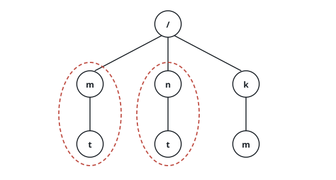
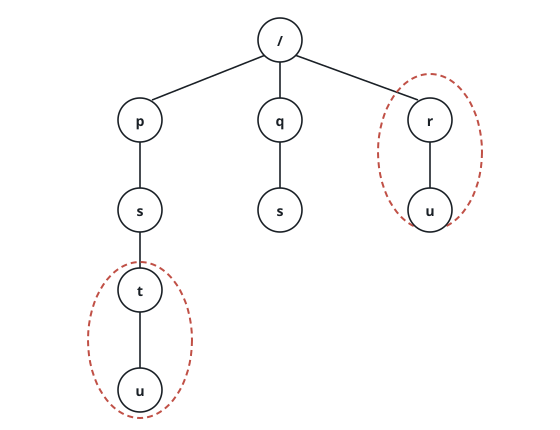
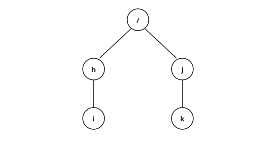

# Prune Duplicate Folders

## Description

A buggy backup tool has littered a file system with copies. You are given a
2D array `paths`; each `paths[i]` spells out one folder's absolute location,
component by component — `["docs", "old", "photos"]` means the folder
`/docs/old/photos`.

Two folders count as identical when their subfolder trees match exactly,
names included, from that folder all the way down; they may sit at different
depths or under different parents. Whenever two or more folders are
identical, every one of them — and everything beneath them — is marked.

- In the structure below, `/m` and `/n` are identical (both hold exactly
  `x` containing `y`, plus `z`), so both subtrees get marked:

```text
/m
/m/x
/m/x/y
/m/z
/n
/n/x
/n/x/y
/n/z
```

- Add `/n/w`, though, and `/m` versus `/n` is no longer a match — although
  `/m/x` and `/n/x` still are.

Marking is computed once, up front; the deletion then runs a single time, so
folders that would only become identical after other folders vanish are
spared.

Return a 2D array `ans` listing the surviving folders' paths. Any ordering
is acceptable.

### Example 1

```text
Input: paths = [["m"],["n"],["k"],["m","t"],["n","t"],["k","m"]]
Output: [["k"],["k","m"]]
Explanation: /m and /n each contain a single empty folder t, so both are
identical; /m, /m/t, /n, and /n/t all go.
```



### Example 2

```text
Input: paths = [["p"],["q"],["p","s"],["q","s"],["p","s","t"],["p","s","t","u"],["r"],["r","u"]]
Output: [["p"],["p","s"],["q"],["q","s"]]
Explanation: /p/s/t and /r each contain one empty folder u, so both
subtrees are marked and removed. Afterwards /p and /q would look alike,
but the marking already happened, so they stay.
```



### Example 3

```text
Input: paths = [["h","i"],["j","k"],["j"],["h"]]
Output: [["h"],["h","i"],["j"],["j","k"]]
Explanation: Nothing matches anything — every folder is unique, and the
order of the answer does not matter.
```



### Constraints

- `1 <= paths.length <= 2 * 10⁴`
- `1 <= paths[i].length <= 500`
- `1 <= paths[i][j].length <= 10`
- `1 <= sum(paths[i][j].length) <= 2 * 10⁵`
- Every `paths[i][j]` is lowercase English letters.
- No two paths name the same folder.
- Whenever a folder appears, its parent appears too (root-level folders
  excepted).

## Hints

### Hint 1

Assemble the whole hierarchy as a trie, one node per folder.

### Hint 2

Decide duplication by hashing each node's subtree into a comparable
signature.

### Hint 3

A folder with nothing inside it can never be the twin of another folder —
the identical set of subfolders has to be non-empty.
