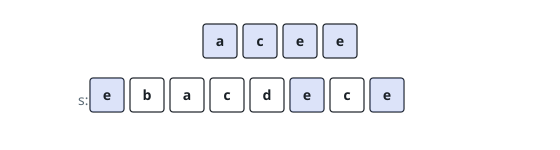

# Smallest Subsequence With a Letter Quota

## Description

You are given a string `s` of lowercase English letters, an integer `k`, a
character `letter`, and an integer `quota`. The character `letter` is
guaranteed to occur in `s` at least `quota` times.

Delete zero or more characters of `s` without reordering the survivors; a
string obtainable that way is a subsequence. Find the subsequence that

- has length exactly `k`,
- contains `letter` at least `quota` times, and
- is lexicographically smallest — earliest in dictionary order, that is,
  at the first position where two candidates differ, the smaller character
  belongs to the answer.

Return that subsequence.

### Example 1

```text
Input: s = "anana", k = 3, letter = "a", quota = 2
Output: "aaa"
Explanation: Taking all three a characters meets the quota with room to
spare and beats every subsequence starting with a larger character.
```

### Example 2

```text
Input: s = "ebacdece", k = 4, letter = "e", quota = 2
Output: "acee"
Explanation: Without the quota the length-4 pick would be "acce". The
quota forces two e characters in, and the best arrangement carrying them
is "acee".
```



### Example 3

```text
Input: s = "aza", k = 2, letter = "a", quota = 2
Output: "aa"
Explanation: Both characters of the answer must be a to reach the quota,
and the two a characters of s supply exactly that.
```

### Constraints

- `1 <= quota <= k <= s.length <= 5 * 10⁴`
- `s` consists of lowercase English letters.
- `letter` is a lowercase English letter occurring in `s` at least
  `quota` times.

## Hints

### Hint 1

Building the answer left to right, a stacked character should give way to a
smaller newcomer — but only when enough characters still remain to finish a
length-`k` answer.

### Hint 2

The quota adds a second brake: evicting a stacked copy of `letter` is safe
only if the copies left behind plus the copies still ahead in `s` can still
reach `quota`. A suffix count of `letter` makes that an `O(1)` check.

### Hint 3

After the scan, the stack may hold more than `k` characters. Which end
should the surplus come off, and which characters should be spared until
last?
