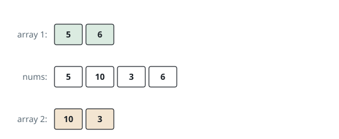
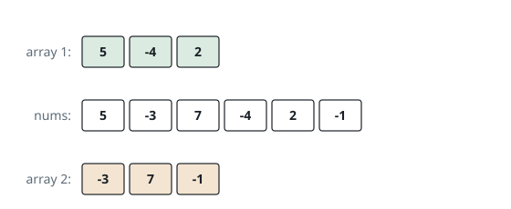

# Most Balanced Even Split

## Description

You are given an integer array `nums` holding `2 * n` values. Split it into
two groups of exactly `n` values each — every value goes into one group or
the other.

Of all such splits, find the one where the two group sums are as close as
possible, and return that smallest achievable gap, `|sum(group 1) -
sum(group 2)|`.

### Example 1

```text
Input: nums = [5,10,3,6]
Output: 2
Explanation: The groups [5,6] and [10,3] sum to 11 and 13. No split of
two-and-two comes closer than a gap of 2.
```



### Example 2

```text
Input: nums = [6,-2]
Output: 8
Explanation: Each group takes one value, so the only split is [6] and
[-2], whose sums differ by 8.
```

### Example 3

```text
Input: nums = [5,-3,7,-4,2,-1]
Output: 0
Explanation: The groups [5,-4,2] and [-3,7,-1] both sum to 3, so the gap
closes entirely.
```



### Constraints

- `1 <= n <= 15`
- `nums.length == 2 * n`
- `-10⁷ <= nums[i] <= 10⁷`

## Hints

### Hint 1

Both groups together sum to `total`, so one group's sum being near
`total / 2` is the whole game. Why can't you simply try every subset?

### Hint 2

Cut the array into halves. A group of `n` values draws some `c` of them
from the first half and `n - c` from the second — enumerate subset sums of
each half separately.

### Hint 3

Bucket the subset sums of each half by how many elements were drawn. For
every sum `a` of `c` elements from the first half, which sum of `n - c`
elements from the second half lands `a + b` nearest `total / 2`?

### Hint 4

Sorted buckets turn that question into a binary search. Doubling the
comparison keeps the arithmetic in exact integers.
