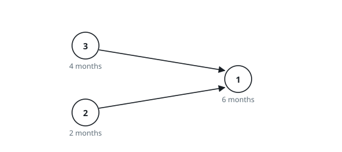
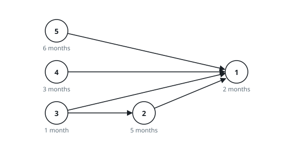

# Fewest Course Months

## Description

There are `n` courses, numbered `1` to `n`. A 2D array `precedence` lists
their ordering constraints: `precedence[j] = [before_j, after_j]` means
course `before_j` must be fully completed before course `after_j` may
begin. The 0-indexed array `time` gives the durations, with `time[i]`
months needed to finish course `i + 1`.

Work out the fewest months needed to finish every course, given:

- a course may begin at any moment once all of its prerequisites are
  finished;
- any number of courses may run at once.

Return the smallest number of months in which all courses can be
completed.

The courses always form a directed acyclic graph, so a full schedule
exists.

### Example 1

```text
Input: n = 3, precedence = [[3,1],[2,1]], time = [6,2,4]
Output: 10
Explanation: Courses 3 and 2 both precede course 1, so they start at
month 0 and run together. Course 2 finishes at month 2, course 3 at
month 4, and course 1 — waiting for the slower of the two — starts at
month 4 and finishes at 4 + 6 = 10.
```



### Example 2

```text
Input: n = 5, precedence = [[5,1],[4,1],[3,1],[3,2],[2,1]], time = [2,5,1,3,6]
Output: 8
Explanation: Courses 3, 4, and 5 start at month 0, finishing at months
1, 3, and 6. Course 2 waits only on course 3, so it runs from month 1 to
month 6. Course 1 waits on all of courses 2, 3, 4, and 5; the last of
them clears at month 6, so course 1 runs from month 6 to month 6 + 2 = 8.
```



### Constraints

- `1 <= n <= 5 × 10⁴`
- `0 <= precedence.length <= min(n × (n − 1) / 2, 5 × 10⁴)`
- `precedence[j].length == 2`
- `1 <= before_j, after_j <= n`
- `before_j != after_j`
- Every pair `[before_j, after_j]` is unique.
- `time.length == n`
- `1 <= time[i] <= 10⁴`
- The courses form a directed acyclic graph.

## Hints

### Hint 1

Course `j` cannot finish before its own duration is spent on top of the
latest finishing time among its prerequisites — that finish time is the
quantity to compute for every course.

### Hint 2

On a DAG, finish times settle in any topological order: by the time a
course comes off a Kahn queue, each prerequisite has already posted its
final finish time.

### Hint 3

The answer is the largest finish time of all — equivalently, the longest
path through the DAG when every course contributes its own duration as
weight.
