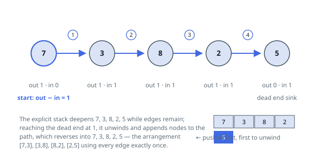

# Solutions — Link Pairs Into One Chain

## Eulerian trail via Hierholzer's algorithm

Read each value as a node and each entry `[from, to]` as a directed edge.
Ordering every entry into one chain is precisely walking a trail that
consumes every edge once — an Eulerian path. The guarantee that a chaining
order exists translates to: the edge-bearing part of the graph is
connected, and at most one node has outdegree exceeding indegree by one.

Build an adjacency map and in/out degree counters in one pass. The start
node is the one whose outdegree tops its indegree by exactly one; if no
such node exists the trail is a closed circuit and any node holding an
edge will do — the code takes `pairs[0][0]`.

The walk itself is iterative Hierholzer with an explicit stack, immune to
the recursion limits that `10⁵` edges would trip. Look at the stack top:
while it still owns an unused edge, pop one (from the end of its list, an
`O(1)` consumption) and push the neighbor. When the top runs out of edges,
it has reached a dead end for the remaining sub-walk — append it to the
output and drop it. Finishing, reverse the output: nodes recorded earliest
were the deepest dead ends, so reversal restores the true trail, and
consecutive nodes of the trail re-form the chained entries.

Take `pairs = [[5,9],[5,3],[3,5],[9,5]]`. Degrees balance everywhere, so
the walk starts at `5`. The stack deepens `5, 3, 5, 9, 5` — note the
adjacency list of `5` holds `[9, 3]`, and consumption from its end visits
`3` first — then unwinds from the dead end, emitting `5, 9, 5, 3, 5`.
Reversed, that is `5, 3, 5, 9, 5`, i.e. the chain
`[5,3], [3,5], [5,9], [9,5]`: both entries leaving `5` are used, in the
order the unwinding dictates.

Repeated values and cycles need no special branches: adjacency lists keep
duplicates as they come, and a circuit simply also closes at its start.

**Complexity:** `O(V + E)` time, `O(V + E)` space.
