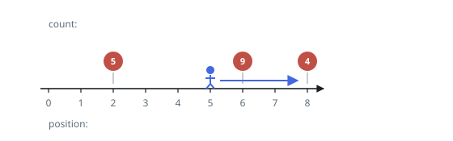
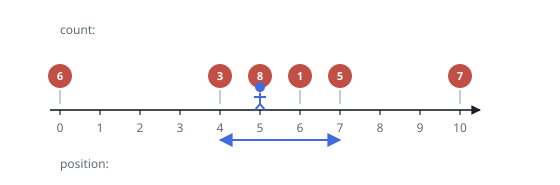
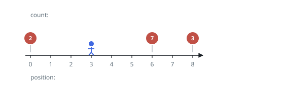

# Fruit Harvest Within a Step Budget

## Description

Fruit grows at isolated points along a path that runs forever in both
directions. The array `fruits` describes the crop: `fruits[i] = [position_i,
amount_i]` says that `amount_i` fruit hang at point `position_i`. The array
arrives sorted by position, and no point appears twice.

You stand at point `startPos` with a budget of `k` steps. Each step carries you
one point to the left or the right, and arriving at a point lets you pick every
fruit growing there.

Return the largest number of fruit you can pick without spending more than `k`
steps.

### Example 1

```text
Input: fruits = [[2,5],[6,9],[8,4]], startPos = 5, k = 4
Output: 13
Explanation: Walking right, point 6 is one step away and point 8 is three, so
both fit in the budget and 9 + 4 = 13 fruit come home. Spending the same
budget leftward reaches only point 2, worth 5.
```



### Example 2

```text
Input: fruits = [[0,6],[4,3],[5,8],[6,1],[7,5],[10,7]], startPos = 5, k = 4
Output: 17
Explanation: Step left to point 4, turn, and continue through 5, 6, and 7. The
tour costs 1 + 3 = 4 steps and yields 3 + 8 + 1 + 5 = 17 fruit. Neither
point 0 nor point 10 fits into a four-step walk.
```



### Example 3

```text
Input: fruits = [[0,2],[6,7],[8,3]], startPos = 3, k = 2
Output: 0
Explanation: Every fruit grows three or more points away, so two steps reach
nothing and the harvest is empty.
```



### Constraints

- `1 <= fruits.length <= 10⁵`
- `fruits[i]` is a pair `[position_i, amount_i]`
- `0 <= startPos, position_i <= 2 * 10⁵`
- `position_0 < position_1 < … < position_{n-1}`
- `1 <= amount_i <= 10⁴`
- `0 <= k <= 2 * 10⁵`

## Hints

### Hint 1

How complicated can a worthwhile walk be? Could doubling back twice ever pick
more than doubling back once?

### Hint 2

An optimal walk turns at most once, so it has one of four shapes: left only,
right only, left then right, right then left. Each shape gathers fruit from one
unbroken stretch of the sorted array.

### Hint 3

Fix the stretch `[l, r]`. If the start lies outside it, the cost is the plain
distance to the far end; if it lies inside, one leg gets walked twice — take
the cheaper leg to double.

### Hint 4

With the cost formula in hand, a stretch is affordable or it is not. Sweep the
sorted array with two pointers and read each stretch's fruit total from a
prefix-sum table.
