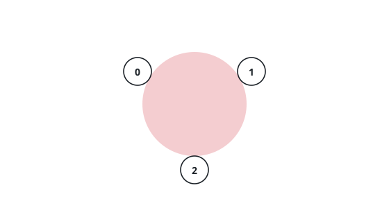
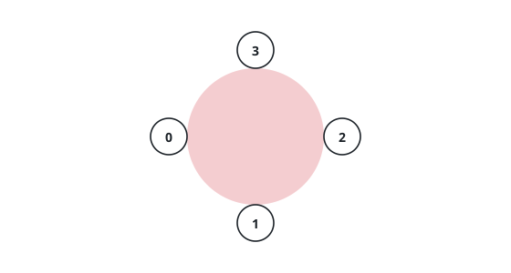

# Round Table Favorites

## Description

`n` employees are candidates for a meeting at a round table big enough to seat
any number of them. The employees are numbered `0` to `n - 1`, and each names
exactly one favorite colleague, never themself. The array `favorite` records
the choices: `favorite[i]` is the person employee `i` wants to sit beside.

An employee will attend only in a seat adjacent to their favorite.

Return the greatest number of employees that can be seated together with
every attendee next to their favorite.

### Example 1

```text
Input: favorite = [1,0,1,1]
Output: 3
Explanation: Employees 0 and 1 name each other, so they take neighboring
seats, and employee 2 — whose favorite is 1 — takes the seat on 1's other
side. Employee 3 also wants the seat beside 1, but both are gone, so the
table holds exactly 3.
```



### Example 2

```text
Input: favorite = [2,0,1]
Output: 3
Explanation: 0 wants 2, 2 wants 1, and 1 wants 0, so the three wants close
into a ring. Seating 0, 1, and 2 around the table puts each between their
favorite and their fan, and nobody can be added to a full ring.
```

### Example 3

```text
Input: favorite = [3,0,1,2,2]
Output: 4
Explanation: Employees 0, 1, 2, and 3 form a ring — 0 wants 3, 3 wants 2,
2 wants 1, 1 wants 0 — so all four sit. Employee 4 wants the seat beside 2,
but 2's two neighbors are already 1 and 3.
```



### Constraints

- `n == favorite.length`
- `2 <= n <= 10⁵`
- `0 <= favorite[i] <= n - 1`
- `favorite[i] != i`

## Hints

### Hint 1

Give every employee one arrow to their favorite. What shape must a graph
have when each node owns exactly one outgoing arrow?

### Hint 2

One legal seating takes a whole cycle of three or more employees: each
member's favorite already occupies a neighboring seat, so nobody outside the
cycle can squeeze in.

### Hint 3

A cycle of exactly two is different: the pair sits together, and the seat on
each of their other sides can hold a chain of employees leading into the
pair. Several such pairs — each with their chains — can share one table.

### Hint 4

How long is the longest chain feeding a given employee, and how do you find
every cycle without repeating work? Peeling nodes that nobody points at
answers both at once.
