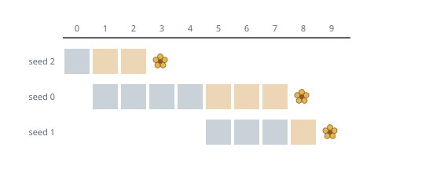
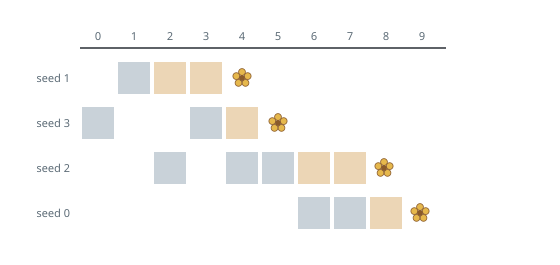

# Earliest Complete Bloom

## Description

You have `n` flower seeds. Each seed must be planted before it can grow, and
only after growing does it bloom. Two 0-indexed arrays of length `n` describe
them, `plantTime` and `growTime`:

- `plantTime[i]` is the number of full days of work needed to plant seed `i`.
  You work on exactly one seed per day, and the days need not be consecutive —
  but the seed stays unplanted until you have put in `plantTime[i]` days on it
  altogether.
- `growTime[i]` is the number of full days seed `i` needs to grow once its
  planting is finished. At the end of its last growth day it blooms, and stays
  bloomed.

Day `0` is the first day of work, and you may plant the seeds in any order.

Return the first day on which every seed has bloomed.

### Example 1

```text
Input: plantTime = [4,3,1], growTime = [3,1,2]
Output: 9
Explanation: Plant seed 2 on day 0; it finishes growing on day 2 and blooms
on day 3. Spend days 1 through 4 planting seed 0; it blooms on day 8. Spend
days 5 through 7 planting seed 1; it blooms on day 9, the last flower to open.
```



### Example 2

```text
Input: plantTime = [2,1,3,2], growTime = [1,2,2,1]
Output: 9
Explanation: One workable calendar: seed 3 gets day 0 and day 3; seed 1 gets
day 1, blooming on day 4; seed 2 gets days 2, 4, and 5, blooming on day 8;
seed 0 gets days 6 and 7, blooming on day 9. The planting days of one seed
may sit around another's — only the totals are fixed.
```



### Example 3

```text
Input: plantTime = [3], growTime = [2]
Output: 5
Explanation: Planting takes days 0, 1, and 2; growth fills days 3 and 4; the
single flower opens on day 5.
```

### Constraints

- `n == plantTime.length == growTime.length`
- `1 <= n <= 10⁵`
- `1 <= plantTime[i], growTime[i] <= 10⁴`

## Hints

### Hint 1

The days of planting work add up to the same total no matter how you
interleave them, and splitting one seed's planting across other work never
advances its bloom. So it suffices to consider seeds planted one after
another.

### Hint 2

With seeds planted back to back, seed `i` finishes planting after the
`plantTime` of itself and everything before it, and blooms that many days
plus its own `growTime` later.

### Hint 3

Which seed should be handed to the soil first — the one that grows quickly,
or the one that grows slowly? Try swapping two adjacent seeds and watch the
bloom days.

### Hint 4

The answer is the latest bloom, not the last seed's bloom: a seed finished
early but slow to grow can still be the one that closes the season.
