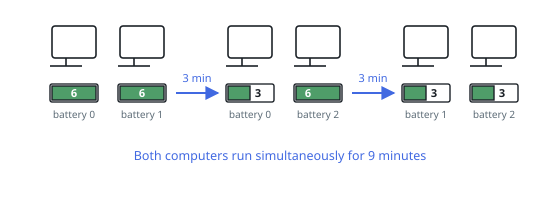
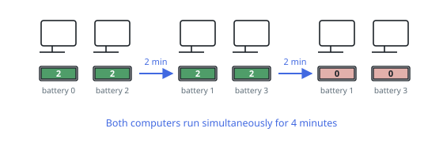

# Longest Parallel Uptime

## Description

You must keep `n` computers running at the same time and have a pile of
batteries to do it with: `batteries[i]` is the number of minutes the `i`-th
battery can power one computer. Also given is the integer `n`.

Each computer holds at most one battery. To start, you fit one battery into
each computer. From then on, at any whole-minute mark, you may pull a battery
out of a computer and slot in another — fresh, or taken from a different
computer — as often as you like, with the swap itself taking no time.

Batteries never recharge.

Return the greatest number of minutes for which all `n` computers can run
together.

### Example 1

```text
Input: n = 2, batteries = [6,6,6]
Output: 9
Explanation: Give batteries 0 and 1 to the two computers. After 3 minutes,
move battery 1 (3 minutes left) aside and slot battery 2 into the second
computer instead. Battery 0 drains at minute 6; put battery 1 into the first
computer, where its last 3 minutes carry both machines to minute 9.
```



### Example 2

```text
Input: n = 2, batteries = [2,2,2,2]
Output: 4
Explanation: Batteries 0 and 2 go in first. Both drain at minute 2, so
batteries 1 and 3 take their places and drain at minute 4, when the fleet
goes dark.
```



### Example 3

```text
Input: n = 2, batteries = [5,4]
Output: 4
Explanation: With one battery per computer and nothing in reserve, the
4-minute battery decides when the pair falls out of step.
```

### Constraints

- `1 <= n <= batteries.length <= 10^5`
- `1 <= batteries[i] <= 10^9`

## Hints

### Hint 1

Suppose somebody names a duration `t`. Can you decide, with one sweep of the
battery list, whether all `n` computers can truly run that long together?

### Hint 2

Over a `t`-minute window a battery serves at most one computer at a time, so
it hands over at most `min(battery, t)` computer-minutes — and the capped
pool can be split freely by swapping. `n` computers for `t` minutes need
exactly `n·t`.

### Hint 3

If `t` minutes are achievable, every shorter duration is too. What kind of
search does a monotone yes/no question invite, and between what bounds?
