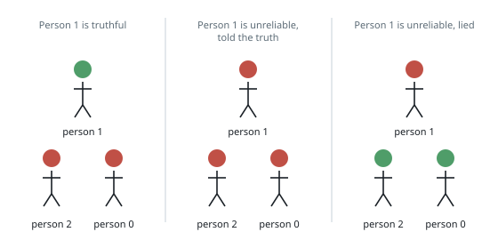
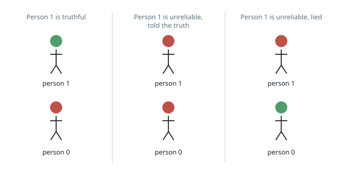

# Largest Truthful Group

## Description

Every person in a group of `n` is one of two kinds:

- **truthful** — every claim they make holds;
- **unreliable** — each claim they make may hold or may be a lie.

The 0-indexed `n x n` array `statements` collects what was said:
`statements[i][j]` is

- `0` when person `i` declares person `j` unreliable,
- `1` when person `i` declares person `j` truthful,
- `2` when person `i` says nothing about person `j`.

Nobody remarks on themselves: `statements[i][i] = 2` for all `i`.

Return the size of the largest group of people that can all be truthful at
once without any statement being contradicted.

### Example 1

```text
Input: statements = [[2,2,1],[0,2,2],[1,2,2]]
Output: 2
Explanation: Three claims are made.
- Person 2 declares person 0 truthful.
- Person 0 declares person 2 truthful.
- Person 1 declares person 0 unreliable.
Take person 1 as the pivot.
- Person 1 truthful: then person 0 is unreliable, and person 2's claim that
  0 is truthful would have to be a lie, making person 2 unreliable too. One
  truthful person.
- Person 1 unreliable and speaking the truth: person 0 is unreliable, so
  person 2's claim is again a lie. No truthful people.
- Person 1 unreliable and lying: person 0 is truthful — and then person 0's
  own claim forces person 2 to be truthful as well. Two truthful people.
Two is the best on offer.
```



### Example 2

```text
Input: statements = [[2,2],[0,2]]
Output: 1
Explanation: Person 1 declares person 0 unreliable, and person 0 says
nothing. If person 1 is truthful, only person 1 counts. If person 1 is
unreliable, the declaration may be a lie — making person 0 the lone truthful
one — or the truth, leaving none. One is the ceiling either way.
```



### Constraints

- `n == statements.length == statements[i].length`
- `2 <= n <= 15`
- `statements[i][j]` is `0`, `1`, or `2`
- `statements[i][i] == 2`

## Hints

### Hint 1

With at most 15 people, how many ways are there to mark each person
truthful or unreliable — and what one integer can encode an entire marking?

### Hint 2

A marking survives only the truthful speakers: every claim a truthful person
makes has to agree with the marking. Claims by unreliable people prove
nothing either way.

### Hint 3

Walk every marking, keep the ones that survive, and remember the largest
count of truthful people among them.
