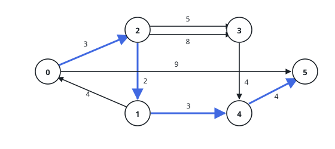
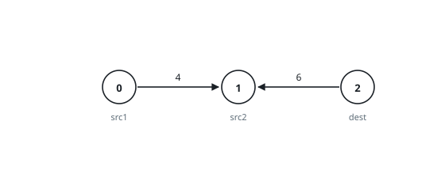

# Minimum Shared Route Weight

## Description

You are given a weighted directed graph on `n` nodes, numbered `0` through
`n - 1`, described by an array `edges` whose entry `edges[i] = [from_i,
to_i, weight_i]` records one directed connection `from_i -> to_i` carrying
weight `weight_i`.

You are also given three distinct nodes `src1`, `src2`, and `dest`.

Pick any set of edges `S` drawn from the graph such that `dest` is reachable
from both `src1` and `src2` using only edges of `S`. Return the minimum
possible total weight of `S`, or `-1` if no such set exists.

Edges shared by the two routes count once, not twice.

### Example 1

```text
Input: n = 6, edges = [[0,2,3],[0,5,9],[1,0,4],[1,4,3],[2,1,2],[2,3,5],[2,3,8],[3,4,4],[4,5,4]], src1 = 0, src2 = 1, dest = 5
Output: 12
Explanation: The highlighted route runs 0 -> 2 -> 1 -> 4 -> 5: src1 reaches
node 1 through 0 -> 2 -> 1 (weight 3 + 2), src2 is already there, and both
share the tail 1 -> 4 -> 5 (weight 3 + 4). Sharing the tail is what beats
sending each source separately — riding 1 -> 0 -> 5 instead would cost
4 + 9 = 13 for src2 alone.
```



### Example 2

```text
Input: n = 3, edges = [[0,1,4],[2,1,6]], src1 = 0, src2 = 1, dest = 2
Output: -1
Explanation: Both edges end at node 1 and nothing ever leaves it — node 2
has no incoming edge at all, so neither source can ever be connected to
dest, and no qualifying set of edges exists.
```



### Constraints

- `3 <= n <= 10^5`
- `0 <= edges.length <= 10^5`
- `edges[i].length == 3`
- `0 <= from_i, to_i, src1, src2, dest <= n - 1`
- `from_i != to_i`
- `src1`, `src2`, and `dest` are three different nodes.
- `1 <= weight_i <= 10^5`

## Hints

### Hint 1

Sketch any candidate set of edges: what do the two routes from `src1` and
`src2` look like as they approach `dest`?

### Hint 2

In a cheapest set the two routes agree from some node onward — if they
crossed and re-split, you could splice them at the crossing and only lose
weight. So the whole answer is determined by one meeting node.

### Hint 3

For each meeting node `v` you need `dist(src1, v)`, `dist(src2, v)`, and
`dist(v, dest)` — three shortest-path tables, the last of which one search
on the reversed graph delivers for every `v` at once.
