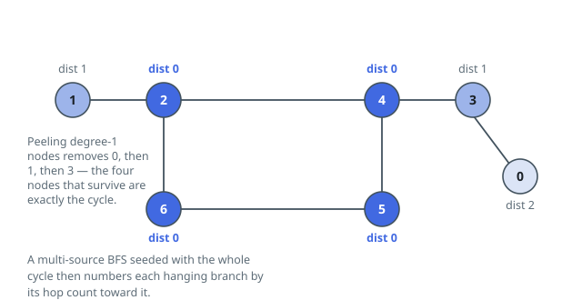

# Solutions — Distance From the Cycle

## Peel the branches, then flood outward

Count: `n` nodes, `n` edges, connected, one cycle. That is exactly one
cycle with trees rooted on it, and the cycle is the graph's 2-core. Deleting
a degree-1 node never orphans the cycle — every cycle member keeps degree
at least 2 — so repeatedly stripping degree-1 nodes removes precisely the
attached trees, layer by layer, and whatever survives the stripping is the
cycle itself. The code seeds a queue with every initially degree-1 node,
marks each popped node removed, and lowers the degree of its surviving
neighbours, enqueuing any that fall to degree 1; each node enters the queue
at most once, so the peel is a linear topological-style pass.

Distances then come free. Seed one BFS with every surviving node at
distance 0, and let it flood outward through the stripped trees: the first
time a node is reached, its distance is one more than its parent's, and
since the only zero-distance nodes are the whole cycle, first arrival is
the minimum hop count to it.

Both passes are linear — each node and edge is touched a constant number
of times — which is what `n = 10^5` demands. The degree array doubles as
the peeling bookkeeping (the `removed` flag guards against re-enqueueing),
and `dist` starts at zero, so the cycle nodes need no separate
initialization.

**Complexity:** `O(n)` time, `O(n)` space.
