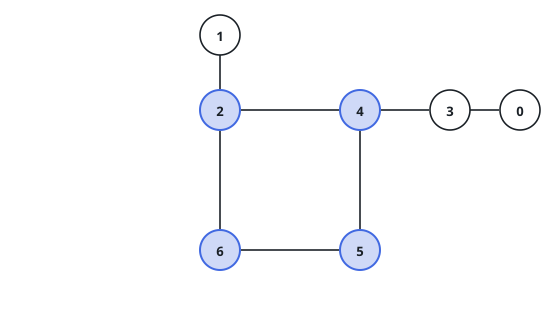
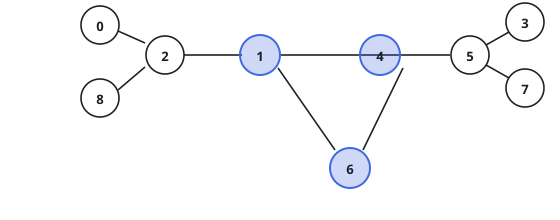

# Distance From the Cycle

## Description

You are given a connected undirected graph with `n` nodes and exactly one
cycle. Nodes are numbered `0` through `n - 1`, and `edges[i] = [a, b]` says
that `a` and `b` are joined by a bidirectional edge.

The distance between two nodes is the fewest edges on any walk between
them.

Return an array `answer` of length `n` in which `answer[i]` is the distance
from node `i` to the nearest node lying on the cycle.

### Example 1

```text
Input: n = 7, edges = [[2,4],[4,5],[5,6],[6,2],[1,2],[3,4],[0,3]]
Output: [2,1,0,1,0,0,0]
Explanation: The square 2-4-5-6 is the cycle, so those four nodes score 0.
Node 1 hangs directly off 2, and node 3 off 4, both at distance 1. Node 0
sits one step beyond 3, at distance 2.
```



### Example 2

```text
Input: n = 9, edges = [[1,4],[1,6],[6,4],[4,5],[5,3],[5,7],[1,2],[2,0],[2,8]]
Output: [2,0,1,2,0,1,0,2,2]
Explanation: The triangle 1-4-6 is the cycle. Off corner 1 hangs a short
stem, node 2, carrying leaves 0 and 8 at distance 2; off corner 4 the same
shape repeats with stem 5 and leaves 3 and 7.
```



### Constraints

- `3 <= n <= 10^5`
- `edges.length == n`
- `edges[i].length == 2`
- `0 <= edges[i][0], edges[i][1] <= n - 1`
- The two endpoints of an edge differ.
- The graph is connected.
- The graph contains exactly one cycle.
- No pair of nodes is joined by more than one edge.

## Hints

### Hint 1

Two subproblems hide here: which nodes form the cycle, and how far the
others are from it. Take them separately.

### Hint 2

A node on any cycle keeps degree at least 2 no matter which branches you
cut. What is left if you keep deleting degree-1 nodes until none remain?

### Hint 3

With the cycle known, one search seeded from all of its nodes at once
spreads the distances outward through the attached trees.
