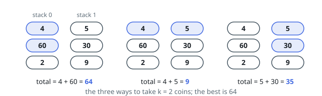

# Max Coins From Stack Tops

## Description

Coins are arranged in `n` vertical stacks. The array `stacks` describes
them: `stacks[i]` holds the values of stack `i`'s coins, listed from the
top of the stack down.

A move takes the coin currently on top of one of the stacks. You make
exactly `k` moves.

Return the largest total value the `k` taken coins can add up to.

### Example 1

```text
Input: stacks = [[4,60,2],[5,30,9]], k = 2
Output: 64
Explanation: Two moves spent on stack 0 collect its top two coins,
4 + 60 = 64. Splitting the moves — the 4 and the 5 — collects 9, and two
moves on stack 1 collect 5 + 30 = 35.
```



### Example 2

```text
Input: stacks = [[50],[50],[3,3,3,900]], k = 5
Output: 959
Explanation: The 900 sits at the bottom of the last stack, and the only
way to it is through the three coins above it — four moves for
3 + 3 + 3 + 900. The fifth move takes a 50 from either single-coin stack,
for 909 + 50 = 959.
```

### Example 3

```text
Input: stacks = [[8,3],[6,1,5],[2]], k = 4
Output: 20
Explanation: Emptying the middle stack costs three moves and yields
6 + 1 + 5 = 12; the fourth move takes the 8 on top of the first stack.
Nothing else reaches 20 with four moves.
```

### Constraints

- `n == stacks.length`
- `1 <= n <= 1000`
- `1 <= stacks[i][j] <= 10^5`
- `1 <= k <= sum(stacks[i].length) <= 2000`

## Hints

### Hint 1

From one stack you can only ever take a prefix — the top `t` coins for
some `t`. What is that prefix worth?

### Hint 2

So the plan is a split of `k` across stacks, each contributing its prefix
sum. Which knapsack does that describe, with the stacks as groups?

### Hint 3

Keep `dp[j]` = best total for exactly `j` coins among the stacks processed
so far, and relax it by every prefix length `t` of the next stack.
