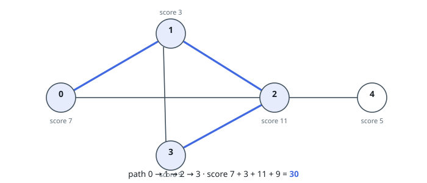
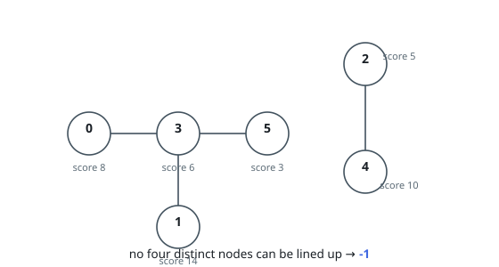

# Highest Four-Node Path Score

## Description

An undirected graph on `n` nodes, numbered `0` to `n - 1`, is described by:

- `scores`, an integer array of length `n` where `scores[i]` is the value
  carried by node `i`;
- `edges`, where `edges[i] = [ai, bi]` says that nodes `ai` and `bi` are
  directly joined.

Line up four **distinct** nodes so that each consecutive pair is joined by an
edge — a simple path that visits four nodes and uses three of the graph's
edges. The score of such a path is the sum of the four node values.

Return the highest score attainable by any four-node path, or `-1` when the
graph contains no such path.

### Example 1

```text
Input: scores = [7,3,11,9,5], edges = [[0,1],[1,2],[2,3],[0,2],[1,3],[2,4]]
Output: 30
Explanation: The path 0 -> 1 -> 2 -> 3 scores 7 + 3 + 11 + 9 = 30, and its
reversal scores the same. The best path that uses node 4 is 1 -> 3 -> 2 -> 4,
worth 3 + 9 + 11 + 5 = 28. Lining the nodes up as 4 -> 2 -> 0 -> 3 is illegal:
no edge joins 0 and 3.
```



### Example 2

```text
Input: scores = [8,14,5,6,10,3], edges = [[0,3],[5,3],[2,4],[1,3]]
Output: -1
Explanation: Nodes 0, 1 and 5 each attach only to node 3, so any route through
that cluster would have to visit 3 twice; the pair 2 - 4 stands apart from
everything else. No four distinct nodes can be lined up, so the answer is -1.
```



### Example 3

```text
Input: scores = [6,1,9,2,8], edges = [[0,1],[1,2],[2,3],[3,4]]
Output: 20
Explanation: The graph is one straight chain, so the path must be four
consecutive nodes. The window 1 -> 2 -> 3 -> 4 scores 1 + 9 + 2 + 8 = 20,
beating 0 -> 1 -> 2 -> 3 at 6 + 1 + 9 + 2 = 18.
```

### Constraints

- `n == scores.length`
- `4 <= n <= 5 * 10⁴`
- `1 <= scores[i] <= 10⁸`
- `0 <= edges.length <= 5 * 10⁴`
- `edges[i].length == 2`
- `0 <= ai, bi <= n - 1`
- `ai != bi`
- Every edge is listed once.

## Hints

### Hint 1

A four-node path is held together by exactly three edges, and one of them sits
in the middle. Enumerating edges instead of paths shrinks the search space.

### Hint 2

Once the middle edge `(a, b)` is fixed, the remaining two nodes `x` and `y`
must satisfy: `x` neighbours `a`, `y` neighbours `b`, and all four nodes are
distinct. The contribution of `a` and `b` is already decided.

### Hint 3

For each side, only the highest-valued neighbours deserve consideration. How
many of them must you keep per node so that a legal choice always survives?

### Hint 4

Three per node are enough: when picking `x`, at most two of the top candidates
can be disqualified — `b` itself, and whichever node `y` turned out to be.
