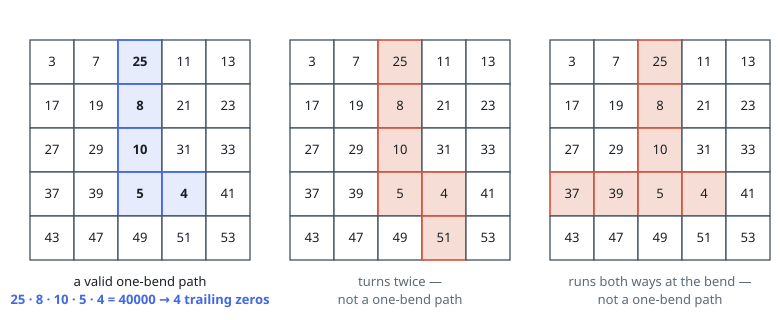
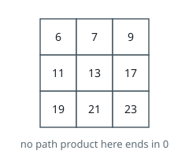

# Most Trailing Zeros on a One-Bend Path

## Description

You are given an `m x n` grid of positive integers.

A **one-bend path** is a run of cells taken as follows: start at any cell and
walk some number of steps in one direction — left or right, or else up or
down — then turn at most once, and from the turn onward walk only in the
perpendicular direction. No cell may be stepped on twice. A path with zero
bends is a straight run, and a lone cell counts as one too.

Take any one-bend path and multiply all the values it covers. Return the
largest number of trailing zeros such a product can end in.

### Example 1

```text
Input: grid = [[3,7,25,11,13],[17,19,8,21,23],[27,29,10,31,33],[37,39,5,4,41],[43,47,49,51,53]]
Output: 4
Explanation: The path marked in the figure runs down one column and then one
cell to the right, covering 25, 8, 10, 5 and 4. Their product is 40000, which
ends in four zeros. No one-bend path does better: the entire grid contains
just four factors of 5 — two in the 25, one in the 10, one in the 5 — and this
path collects all of them.
```



### Example 2

```text
Input: grid = [[6,7,9],[11,13,17],[19,21,23]]
Output: 0
Explanation: No value in this grid has 5 as a factor, so every product is
missing a 5 and none can end in zero.
```



### Example 3

```text
Input: grid = [[5,2,4,25]]
Output: 3
Explanation: A single row is a legitimate zero-bend path. Taking the whole
row gives 5 * 2 * 4 * 25 = 1000, which ends in three zeros.
```

### Constraints

- `m == grid.length`
- `n == grid[i].length`
- `1 <= m, n <= 10⁵`
- `1 <= m * n <= 10⁵`
- `1 <= grid[i][j] <= 1000`

## Hints

### Hint 1

To know how a long product ends, do you need the product itself, or only some
summary of its factors?

### Hint 2

The number of trailing zeros is `min(total factors of 2, total factors of 5)`.
Both totals add up along the path — nothing about multiplying matters anymore.

### Hint 3

Think of every cell as the corner where a bend would sit: the path is one
horizontal arm joined to one vertical arm. Which four arm pairings must you
consider?

### Hint 4

Prefix sums of both factor counts along every row and every column turn each
arm's contribution into a single subtraction.
