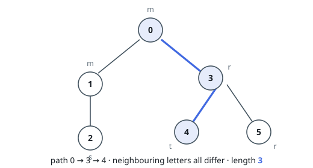

# Longest Path With Unequal Adjacent Letters

## Description

You are given a rooted tree on `n` nodes numbered `0` to `n - 1`, with node `0`
as the root. The tree arrives as a 0-indexed array `parent` of length `n`:
`parent[i]` is the parent of node `i`, and `parent[0] == -1`.

Each node also carries a letter — `s[i]`, where `s` is a string of length `n`.

A path is legal when every pair of nodes sitting next to each other along it
has different letters. Return the number of nodes on the longest legal path.

### Example 1

```text
Input: parent = [-1,0,1,0,3,3], s = "mmsrtr"
Output: 3
Explanation: Walking 0 -> 3 -> 4 gives the letters m, r, t — each neighbouring
pair differs, and the path covers 3 nodes. Nothing longer is legal: node 1
carries the same m as the root, so that whole branch is cut off above it, and
node 5 repeats node 3's r, cutting off that leaf as well.
```



### Example 2

```text
Input: parent = [-1,0,0,2], s = "mmrt"
Output: 3
Explanation: Node 1 repeats the root's m, so the edge to it is unusable. The
other branch runs deeper: the route 0 -> 2 -> 3 reads m, r, t and covers
3 nodes.
```

### Example 3

```text
Input: parent = [-1,0,1,2,3], s = "qwert"
Output: 5
Explanation: The tree is a straight chain and every neighbouring pair of
letters differs, so the entire chain of 5 nodes is one legal path.
```

### Constraints

- `n == parent.length == s.length`
- `1 <= n <= 10⁵`
- `0 <= parent[i] <= n - 1` for all `i >= 1`
- `parent[0] == -1`
- `parent` encodes a valid tree.
- `s` contains only lowercase English letters.

## Hints

### Hint 1

Process the tree from the leaves upward. At each node, the best legal path
whose topmost node it is joins two chains descending into two of its children.

### Hint 2

So each node needs to know the longest legal chain starting at itself and
running down into its subtree — and keeping the two largest child chains is
enough to join them through the node.

### Hint 3

A child's chain may only be lengthened through the current node when the two
nodes' letters differ; otherwise that chain contributes nothing to the join.
