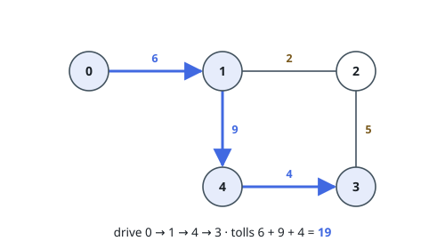
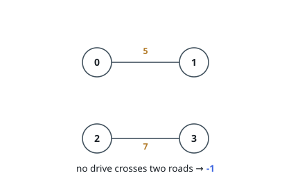

# Heaviest Trip Over Exactly K Roads

## Description

`n` towns are numbered `0` to `n - 1`, and a network of toll roads connects
some pairs of them. You are given:

- `roads`, where `roads[i] = [town1_i, town2_i, toll_i]` describes a two-way
  road between `town1_i` and `town2_i` costing `toll_i` to drive;
- an integer `k`.

Plan a drive that uses **exactly** `k` roads. You may set out from any town,
but no town may be entered more than once over the whole drive.

Return the largest total toll such a drive can accumulate, or `-1` if no drive
meeting the requirements exists.

### Example 1

```text
Input: n = 5, roads = [[0,1,6],[2,1,2],[1,4,9],[3,2,5],[3,4,4]], k = 3
Output: 19
Explanation: Driving 0 -> 1 -> 4 -> 3 pays 6 + 9 + 4 = 19. The best drive that
avoids town 0 is 2 -> 3 -> 4 -> 1 at 5 + 4 + 9 = 18. A route like
2 -> 1 -> 0 -> 1 is not a legal drive at all — town 1 would be entered twice.
```



### Example 2

```text
Input: n = 4, roads = [[0,1,5],[2,3,7]], k = 2
Output: -1
Explanation: Each drive stays inside one two-town pair, so no drive can string
two roads together.
```



### Example 3

```text
Input: n = 4, roads = [[0,1,2],[1,2,4],[2,3,6],[3,0,8]], k = 3
Output: 18
Explanation: The network is one four-town loop. A three-road drive drops
exactly one road, so the answer is the loop's total 2 + 4 + 6 + 8 = 20 minus
the cheapest road, 2, giving 18.
```

### Constraints

- `2 <= n <= 15`
- `1 <= roads.length <= 50`
- `roads[i].length == 3`
- `0 <= town1_i, town2_i <= n - 1`
- `town1_i != town2_i`
- `0 <= toll_i <= 100`
- `1 <= k <= 50`
- No road appears twice.

## Hints

### Hint 1

How far a partial drive can be stretched does not depend on the order the
towns were visited in — only on which towns are behind you and where you stand
now.

### Hint 2

With that in mind, keep the visited towns as a bitmask and the current town,
and run dynamic programming over `(visited set, current town)` states.

### Hint 3

A drive over exactly `k` roads enters exactly `k + 1` distinct towns. What
does that say when `k + 1` exceeds `n`?
