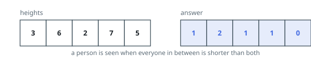
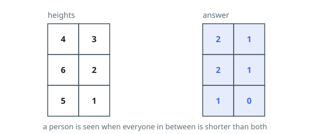

# Grid Sight Lines

## Description

You are given an `m x n` grid of positive integers `heights`, where
`heights[i][j]` is the height of the person standing at cell `(i, j)`.

The person at `(row1, col1)` has a clear sight line to the person at
`(row2, col2)` when both of these hold:

- The second person stands directly right or directly below the first:
  either `row1 == row2` and `col1 < col2`, or `row1 < row2` and
  `col1 == col2`.
- Every person standing strictly between the two is shorter than both of
  them.

Return an `m x n` grid `answer` where `answer[i][j]` is the number of
clear sight lines the person at `(i, j)` has.

### Example 1

```text
Input: heights = [[3,6,2,7,5]]
Output: [[1,2,1,1,0]]
Explanation:
- The person at (0, 0) sees only the person at (0, 1); the taller 6 there
  hides the rest of the row.
- The person at (0, 1) sees (0, 2) directly, and (0, 3) across the
  shorter 2, for a count of 2.
- The person at (0, 2) sees (0, 3); the 7 then blocks (0, 4).
- The person at (0, 3) sees (0, 4).
- The person at (0, 4) sees nobody.
```



### Example 2

```text
Input: heights = [[4,3],[6,2],[5,1]]
Output: [[2,1],[2,1],[1,0]]
Explanation:
- The person at (0, 0) sees (0, 1) to the right and (1, 0) below. The 6
  at (1, 0) hides (2, 0) from them.
- The person at (0, 1) sees (1, 1) below; the 2 there hides (2, 1).
- The person at (1, 0) sees (1, 1) and (2, 0).
- The person at (1, 1) sees (2, 1).
- The person at (2, 0) sees (2, 1).
- The person at (2, 1) sees nobody.
```



### Example 3

```text
Input: heights = [[5,5,2],[3,7,7]]
Output: [[2,2,1],[1,1,0]]
Explanation:
- The person at (0, 0) sees the equally tall person at (0, 1) — matching
  heights still count — and the 5 then blocks (0, 2). Below, (1, 0) is
  visible, for a count of 2.
- The person at (1, 1) sees the equally tall person at (1, 2), and nobody
  beyond them.
```

### Constraints

- `1 <= heights.length <= 400`
- `1 <= heights[i].length <= 400`
- `1 <= heights[i][j] <= 10^5`

## Hints

### Hint 1

Stand at one cell and look rightward: read off the heights you can see,
in order. What does that sequence look like?

### Hint 2

Walk each row from its right end, keeping a stack of heights that a
cell further left could still see. When a new height arrives, the stack
tells you in one step how many people that cell sees to its right.

### Hint 3

Treat an equal height carefully: the matching person is counted, and
afterwards nobody behind them can be.

### Hint 4

Whatever the row sweep counts horizontally, the same sweep down each
column adds vertically.
