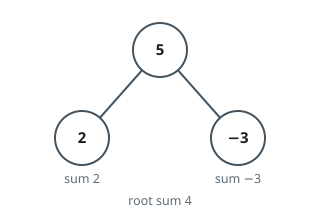
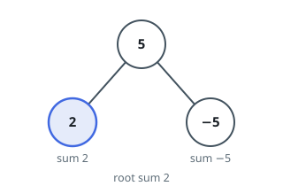

# Most Common Subtree Total

## Description

You're given the `root` of a binary tree. Every node has a subtree total —
the sum of every value in the subtree rooted there, the node itself
included. Report whichever subtree total shows up most often across the
whole tree. If several totals are tied for the top frequency, report all
of them.

LeetCode's original lets tied totals come back in any order; this judge
compares arrays exactly, so return them sorted ascending — that's still
the same set of values the original would accept, just fixed to one
arrangement.

### Example 1



```text
Input: root = [5,2,-3]
Output: [-3,2,4]
Explanation: The three subtree totals are 2 (leaf), -3 (leaf), and
5 + 2 + (-3) = 4 (root); each occurs exactly once, so every one of them
is reported, sorted ascending.
```

### Example 2



```text
Input: root = [5,2,-5]
Output: [2]
Explanation: The totals are 2, -5, and 5 + 2 + (-5) = 2; since 2 occurs
twice and -5 only once, 2 alone is the most common total.
```

### Example 3

```text
Input: root = [1,2,3]
Output: [2,3,6]
Explanation: The totals are 2, 3, and 1 + 2 + 3 = 6, each occurring once,
so all three tie for most common.
```

### Constraints

- The tree holds between `1` and `10⁴` nodes.
- Every node value fits in `[-10⁵, 10⁵]`.
