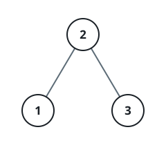

# Ordered Successor II

## Description

Given one node of a binary search tree, return the node holding the next
larger value in the tree's in-order sequence — the smallest key greater than
`node.val`. A node with no such successor yields `null`.

The tree is presented as a level-order array; the judge wires every `parent`
link and hands your method the root plus the query value (all values are
unique). The successor crosses back as its serialization through the level
walk: its own value, then `null` and the first child found on each step
down — so a leaf successor serializes as just its value, and an absent
successor returns `[]`.

### Example 1



```text
Input: tree = [2,1,3], node = 1
Output: [2, null, 1]
Explanation: 1's in-order successor is the node 2; it serializes as its own
value, then the first child 1 on the step down.
```

### Example 2


```text
Input: tree = [5,3,6,2,4,null,null,1], node = 6
Output: []
Explanation: 6 is the largest value in the tree, so it has no successor.
```

### Constraints

- The tree holds between `1` and `10⁴` nodes.
- `-10⁵ <= Node.val <= 10⁵`
- All node values are unique.

### Follow-up

Can you find the successor without ever comparing values?
