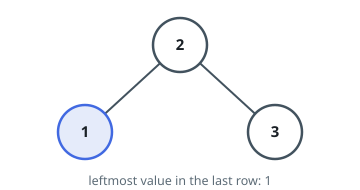
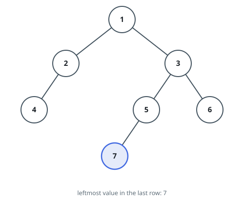

# Deepest Left Corner

## Description

You are given the `root` of a binary tree. Among all the nodes that sit
on its deepest row, report the value held by whichever one is furthest
to the left.

### Example 1



```text
Input: root = [2,1,3]
Output: 1
```

### Example 2



```text
Input: root = [1,2,3,4,null,5,6,null,null,7]
Output: 7
```

### Constraints

- The tree contains between `1` and `10⁴` nodes.
- `-2³¹ <= Node.val <= 2³¹ - 1`
