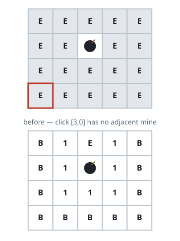
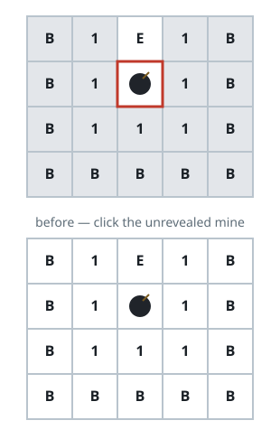

# Board Reveal

## Description

A minesweeper board uses `'M'` for an unrevealed mine, `'E'` for an
unrevealed empty square, `'B'` for a revealed blank with no adjacent mines,
a digit `'1'`–`'8'` for a revealed square near that many mines, and `'X'`
for a revealed mine. A click lands on some unrevealed square.

Reveal per the usual rules: a clicked mine turns to `'X'`; a clicked empty
square with no adjacent mines turns to `'B'` and reveals its whole
neighborhood recursively; a clicked empty square with adjacent mines turns
into the digit counting them. Return the board once nothing more can change.

### Example 1



```text
Input: board = [["E","E","E","E","E"],["E","E","M","E","E"],["E","E","E","E","E"],["E","E","E","E","E"]], click = [3,0]
Output: [["B","1","E","1","B"],["B","1","M","1","B"],["B","1","1","1","B"],["B","B","B","B","B"]]
```

### Example 2



```text
Input: board = [["B","1","E","1","B"],["B","1","M","1","B"],["B","1","1","1","B"],["B","B","B","B","B"]], click = [1,2]
Output: [["B","1","E","1","B"],["B","1","X","1","B"],["B","1","1","1","B"],["B","B","B","B","B"]]
```

### Constraints

- `m == board.length`
- `n == board[i].length`
- `1 <= m, n <= 50`
- Each cell is `'M'`, `'E'`, `'B'`, or a digit.
- The click is a valid unrevealed `'M'` or `'E'` cell.
