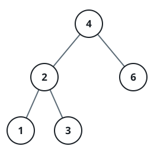
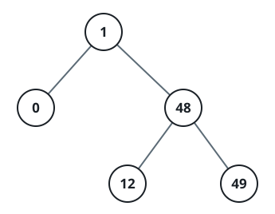

# Closest Node Gap

## Description

In a binary search tree, the two values of any two distinct nodes differ by
some positive distance. Return the smallest such distance across the whole
tree.

### Example 1



```text
Input: root = [4,2,6,1,3]
Output: 1
```

### Example 2



```text
Input: root = [1,0,48,null,null,12,49]
Output: 1
```

### Constraints

- The tree holds between `2` and `10⁴` nodes.
- `0 <= Node.val <= 10⁵`
