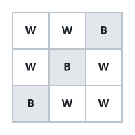
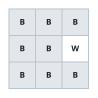

# Solo Black Cells I

## Description

An `m x n` picture uses `'B'` for black and `'W'` for white pixels. A black
pixel is solitary when its entire row and its entire column each contain no
other black pixel. Count the solitary black pixels.

### Example 1



```text
Input: picture = [["W","W","B"],["W","B","W"],["B","W","W"]]
Output: 3
Explanation: Each of the three black pixels sits alone in its row and column.
```

### Example 2



```text
Input: picture = [["B","B","B"],["B","B","W"],["B","B","B"]]
Output: 0
Explanation: Every row and every column carries several black pixels.
```

### Constraints

- `m == picture.length`
- `n == picture[i].length`
- `1 <= m, n <= 500`
- `picture[i][j]` is `'W'` or `'B'`.
