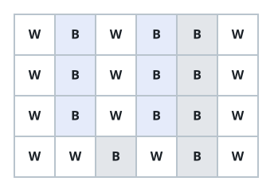
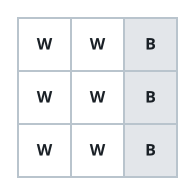

# Solitary Pixel Count II

## Description

You are given an `m x n` grid of black (`'B'`) and white (`'W'`) pixels,
along with an integer `target`. Count how many black pixels are
**solitary**.

A black pixel at position `(r, c)` is solitary when both of the following
hold:

- Row `r` and column `c` each contain exactly `target` black pixels.
- Every row that has a black pixel in column `c` is identical, character for
  character, to row `r`.

Return the number of solitary black pixels in the grid.

### Example 1



```text
Input: picture = [["W","B","W","B","B","W"],["W","B","W","B","B","W"],["W","B","W","B","B","W"],["W","W","B","W","B","W"]], target = 3
Output: 6
Explanation: The highlighted 'B' cells are the solitary pixels — every 'B' in column 1 and every 'B' in column 3.
Take the 'B' at row r = 0, column c = 1:
 - Row 0 and column 1 each hold exactly target = 3 black pixels.
 - The rows with a black pixel in column 1 are rows 0, 1, and 2, and all three are identical to row 0.
```

### Example 2



```text
Input: picture = [["W","W","B"],["W","W","B"],["W","W","B"]], target = 1
Output: 0
```

### Constraints

- `m == picture.length`
- `n == picture[i].length`
- `1 <= m, n <= 200`
- `picture[i][j]` is either `'W'` or `'B'`.
- `1 <= target <= min(m, n)`
