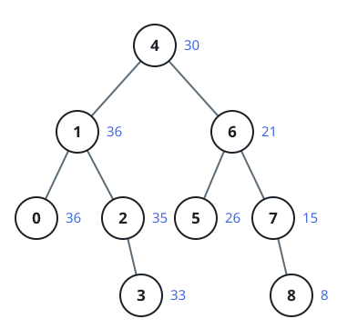

# Greater-Sum BST

## Description

You are given the `root` of a Binary Search Tree (BST). Transform it in
place so that every node's key becomes its original key plus the sum of
every key in the tree that is strictly greater than it, then return the
transformed root.

As a reminder, a binary search tree satisfies these constraints:

- Every node in a left subtree holds a key smaller than its parent's.
- Every node in a right subtree holds a key larger than its parent's.
- Both subtrees are themselves binary search trees.

### Example 1



```text
Input: root = [4,1,6,0,2,5,7,null,null,null,3,null,null,null,8]
Output: [30,36,21,36,35,26,15,null,null,null,33,null,null,null,8]
```

### Example 2

```text
Input: root = [3,2,4]
Output: [7,9,4]
```

### Constraints

- The tree holds between `0` and `10⁴` nodes.
- `-10⁴ <= Node.val <= 10⁴`
- Every key in the tree is unique.
- `root` always describes a valid binary search tree.
