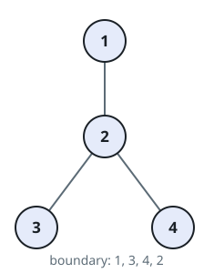
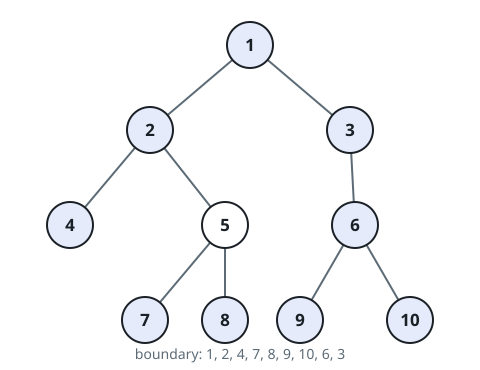

# Binary Tree Perimeter

## Description

Picture tracing the outline of a binary tree the way you'd trace a
silhouette with a pencil: start at the root, walk down its left edge,
sweep across the bottom picking up every leaf, then walk back up its
right edge. Read off as values in the order you touch them, that walk
is the tree's perimeter.

The two edges are defined precisely as follows.

- **Left edge**: begins at the root's left child (empty if the root has
  none). From each node on the edge, step to its left child whenever one
  exists; if a node has no left child but does have a right child, step
  there instead. The walk halts the moment it would step onto a leaf —
  that leaf is never counted as part of the edge.
- **Right edge**: the mirror image. It begins at the root's right child,
  prefers stepping to a right child over a left one, and likewise stops
  short of the leaf it terminates at.

A **leaf** is any node with no children at all, and the leaves are
listed in left-to-right order across the whole tree. The root is never
treated as a leaf, even if it happens to have no children of its own.

The complete perimeter concatenates, in order: the root, the left edge
read top to bottom, every leaf left to right, and the right edge read
bottom to top (i.e., reversed from how it was walked).

Given the `root` of a binary tree, return its perimeter as this ordered
list of values.

### Example 1



```text
Input: root = [1,null,2,3,4]
Output: [1,3,4,2]
Explanation: The root has no left child, so the left edge is empty. Its
right child is 2, and 2's right child 4 is a leaf, so the right edge —
before reversing — is just [2]. Nodes 3 and 4 have no children of their
own, so the leaves left to right are [3,4]. Concatenating gives root [1]
+ left edge [] + leaves [3,4] + reversed right edge [2] = [1,3,4,2].
```

### Example 2



```text
Input: root = [1,2,3,4,5,6,null,null,null,7,8,9,10]
Output: [1,2,4,7,8,9,10,6,3]
Explanation: Walking down from the root's left child 2 reaches leaf 4
right away, so the left edge is [2]. Walking down from the root's right
child 3 passes through 6 and reaches leaf 10, so the right edge, walked
top to bottom, is [3,6] — reversed for the final answer, [6,3]. Scanning
every childless node left to right gives leaves [4,7,8,9,10]. Putting it
together: root [1] + left edge [2] + leaves [4,7,8,9,10] + reversed
right edge [6,3] = [1,2,4,7,8,9,10,6,3].
```

### Constraints

- The tree holds between `1` and `10⁴` nodes.
- Every node value satisfies `-1000 <= Node.val <= 1000`.
