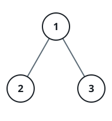

# Binary Tree Value Streak II

## Description

Given the `root` of a binary tree, find the length of its longest value
streak.

A value streak is a path through the tree whose node values form a run of
consecutive integers, each one step from the last — either always up by
one or always down by one. `[1,2,3,4]` and `[4,3,2,1]` both qualify;
`[1,2,4,3]` does not, since `2` to `4` skips a value.

Unlike a plain root-to-leaf reading, the streak is not required to run
downward from an ancestor to a descendant. It may pass through a node by
entering from one child and leaving through the other — a
child-parent-child shape — as long as every step along the way still
differs by exactly one.

### Example 1



```text
Input: root = [1,2,3]
Output: 2
Explanation: The longest streak is [1, 2] or [2, 1].
```

### Example 2


```text
Input: root = [2,1,3]
Output: 3
Explanation: The longest streak is [1, 2, 3] or [3, 2, 1].
```

### Example 3

```text
Input: root = [5,4,6,null,null,null,7]
Output: 4
Explanation: The root's left child is 4 and its right child is 6, and 6's
right child is 7. Reading 4, 5, 6, 7 crosses the root once, stepping up by
one the whole way, for a streak of length 4.
```

### Constraints

- The number of nodes in the tree is in the range `[1, 3 * 10⁴]`.
- `-3 * 10⁴ <= Node.val <= 3 * 10⁴`
