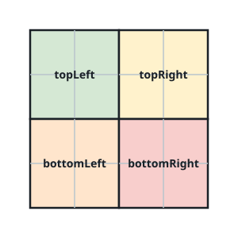
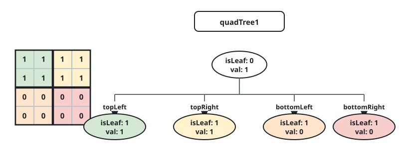
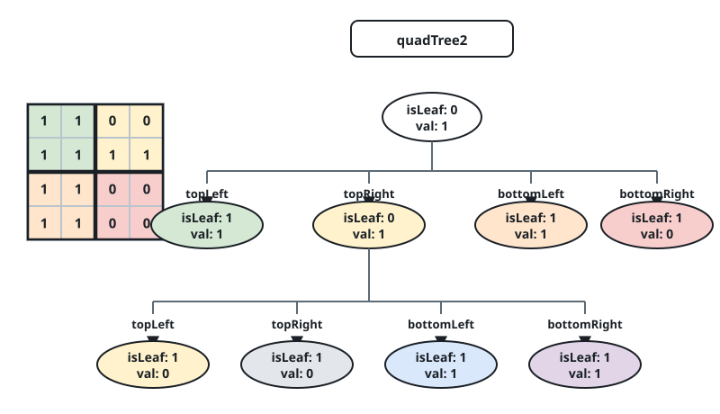

# Quad-Tree Grid Union

## Description

A binary grid is an `n x n` matrix whose entries are all either `0` or `1`.
A Quad-Tree compresses such a grid into a tree where every internal node
has exactly four children, and each node carries two fields:

- `val`: `true` if the node stands for a region that is entirely `1`s, or
  `false` if the region is entirely `0`s.
- `isLeaf`: `true` if the node is a leaf, `false` if it instead has four
  children.

```text
class Node {
    public boolean val;
    public boolean isLeaf;
    public Node topLeft;
    public Node topRight;
    public Node bottomLeft;
    public Node bottomRight;
}
```

A Quad-Tree is built from a grid recursively:

- If every cell in the current region shares the same value, mark the node
  as a leaf, set `val` to that shared value, and give it no children.
- Otherwise mark the node as internal (`isLeaf = false`, `val` may be
  anything), split the region into four equal quadrants as pictured below,
  and recurse into each one.



You are given `quadTree1` and `quadTree2`, two Quad-Trees that each encode
an `n x n` binary grid. Build and return the Quad-Tree that encodes the
grid obtained by taking the elementwise logical OR of the two source
grids. You never need to materialize either grid as an actual matrix to
solve this — everything can be done by walking the trees directly. Also
note that when a node is internal (`isLeaf` is `false`), its `val` field
may be reported as either `true` or `false` — both are accepted.

Quad-Trees are serialized in the input/output as a level-order list, using
`null` to mark a path with no node beneath it (the same convention as
binary-tree serialization). Each present node is written as the pair
`[isLeaf, val]`, with `true` encoded as `1` and `false` encoded as `0`.

### Example 1





```text
Input: quadTree1 = [[0,1],[1,1],[1,1],[1,0],[1,0]], quadTree2 = [[0,1],[1,1],[0,1],[1,1],[1,0],null,null,null,null,[1,0],[1,0],[1,1],[1,1]]
Output: [[0,0],[1,1],[1,1],[1,1],[1,0]]
Explanation: quadTree1 and quadTree2 are shown above, each standing for the binary grid drawn beneath it.
Taking the elementwise logical OR of those two grids produces the grid shown next, which the output tree encodes.
The grids themselves are only drawn here for illustration — the solution never has to build them explicitly.
```


### Example 2

```text
Input: quadTree1 = [[1,0]], quadTree2 = [[1,0]]
Output: [[1,0]]
Explanation: Both trees encode a single 1*1 grid holding the value zero, so their OR is the same 1*1 grid of zero.
```

### Constraints

- `quadTree1` and `quadTree2` are each a valid Quad-Tree encoding an
  `n * n` grid.
- `n == 2^x` for some `0 <= x <= 9`.
