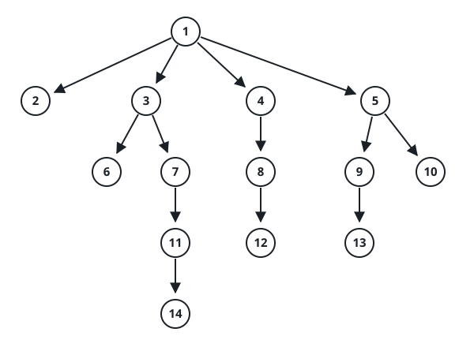

# N-Ary Tree Height

## Description

An n-ary tree's height is the number of nodes on the longest root-to-leaf
path. Given the tree's level-order serialization (each group of children
separated by `null`), return its height.

### Example 1


```text
Input: root = [1,null,3,2,4,null,5,6]
Output: 3
```

### Example 2



```text
Input: root = [1,null,2,3,4,5,null,null,6,7,null,8,null,9,10,null,null,11,null,12,null,13,null,null,14]
Output: 5
```

### Constraints

- The tree holds between `0` and `10⁴` nodes.
- The height is at most `1000`.
