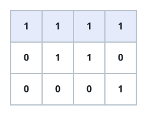

# Longest Straight Run of Ones

## Description

A binary matrix may contain runs of consecutive `1`s along a horizontal,
vertical, or either diagonal line. Return the length of the longest such run.

### Example 1


```text
Input: mat = [[0,1,1,0],[0,1,1,0],[0,0,0,1]]
Output: 3
```

### Example 2



```text
Input: mat = [[1,1,1,1],[0,1,1,0],[0,0,0,1]]
Output: 4
```

### Constraints

- `m == mat.length`
- `n == mat[i].length`
- `1 <= m, n <= 10⁴`
- `1 <= m * n <= 10⁴`
- `mat[i][j]` is `0` or `1`.
