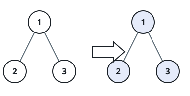
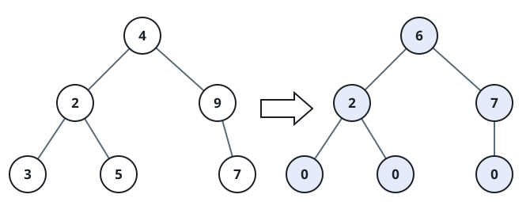
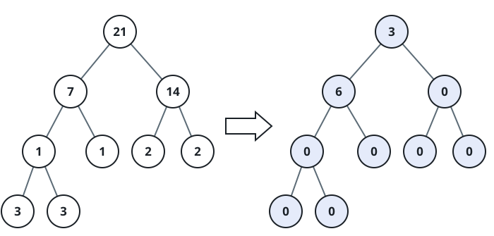

# Cumulative Tree Tilt

## Description

A node's tilt is the absolute difference between the sum of the values in
its left subtree and the sum of the values in its right subtree, where an
absent child contributes `0`. Return the sum of the tilts of every node in a
binary tree.

### Example 1



```text
Input: root = [1,2,3]
Output: 1
Explanation: Nodes 2 and 3 are leaves (tilt 0 each); node 1's tilt is
|2 - 3| = 1, so the total is 1.
```

### Example 2



```text
Input: root = [4,2,9,3,5,null,7]
Output: 15
Explanation: The tilts are 0, 0, 0 (the three leaves), 2 (node 2, |3-5|),
7 (node 9, |0-7|), and 6 (node 4, |10-16|), totaling 15.
```

### Example 3



```text
Input: root = [21,7,14,1,1,2,2,3,3]
Output: 9
```

### Constraints

- The tree holds between `0` and `10⁴` nodes.
- `-1000 <= Node.val <= 1000`

## Hints

### Hint 1

Compute each subtree's total in a single post-order pass.

### Hint 2

Every node's tilt depends only on its two child subtree totals, which a
post-order visit supplies before it reaches the node itself.
