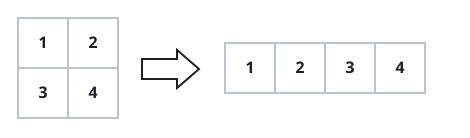
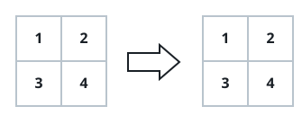

# Matrix Reflow

## Description

Many array libraries offer a `reshape` operation: pour a matrix's
values out in row order and pour them back in as a differently
shaped rectangle, without losing or duplicating a single entry.

You are given an `m x n` matrix `mat` together with two integers `r`
and `c` naming the row and column counts of a desired reshaped
matrix. Read `mat`'s entries in row-major order — all of row 0, then
all of row 1, and so on — and write them back out in that same order
to fill an `r x c` matrix.

If `r x c` does not hold exactly as many cells as `mat` has entries,
the reshape cannot be performed; in that case return `mat` unchanged.

### Example 1



```text
Input: mat = [[1,2],[3,4]], r = 1, c = 4
Output: [[1,2,3,4]]
```

### Example 2



```text
Input: mat = [[1,2],[3,4]], r = 2, c = 4
Output: [[1,2],[3,4]]
Explanation: mat has only 4 entries, but the requested 2 x 4 shape
needs 8, so the reshape is impossible and the original matrix is
returned as-is.
```

### Constraints

- `m == mat.length`
- `n == mat[i].length`
- `1 <= m, n <= 100`
- `-1000 <= mat[i][j] <= 1000`
- `1 <= r, c <= 300`
