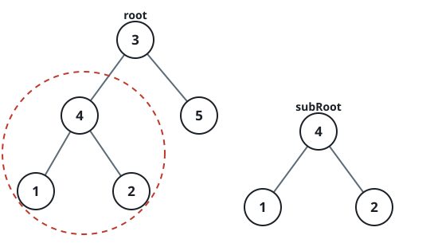
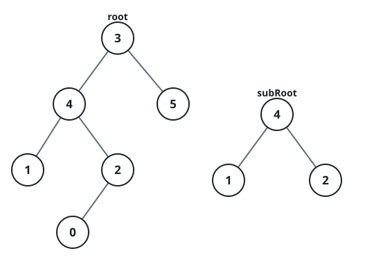

# Contained Tree

## Description

A subtree of a binary tree is some node of the tree together with all of its
descendants; a tree is its own subtree. Given the roots of two binary trees,
report whether the second tree appears as a subtree of the first with the
same structure and node values.

### Example 1



```text
Input: root = [3,4,5,1,2], subRoot = [4,1,2]
Output: true
```

### Example 2



```text
Input: root = [3,4,5,1,2,null,null,null,null,0], subRoot = [4,1,2]
Output: false
Explanation: The node 4 in root has a third child 0, so its subtree is not
exactly [4,1,2].
```

### Constraints

- The first tree holds `1..2000` nodes and the second `1..1000`.
- Node values lie in `[-10⁴, 10⁴]`.
