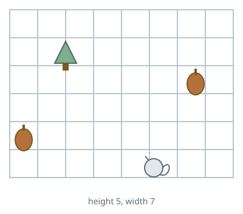
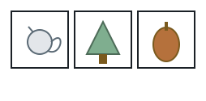

# Nut Gathering Route

## Description

A squirrel lives in a `height x width` garden and can move one cell at a
time in the four cardinal directions. It must collect every nut and return
each one to a tree, carrying at most one nut at a time. The squirrel starts
at its own position.

Return the minimum total distance (in moves) to gather all nuts under the
tree.

### Example 1



```text
Input: height = 5, width = 7, tree = [2,2], squirrel = [4,4], nuts = [[3,0],[2,5]]
Output: 12
Explanation: Visiting the nut at [2,5] first minimizes the trip.
```

### Example 2



```text
Input: height = 1, width = 3, tree = [0,1], squirrel = [0,0], nuts = [[0,2]]
Output: 3
```

### Constraints

- `1 <= height, width <= 100`
- `1 <= nuts.length <= 5000`
- All coordinates are in bounds.
