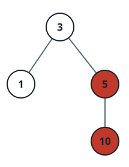

# Process Termination Cascade

## Description

A machine is running `n` processes that form a rooted tree. You are given
two integer arrays `pid` and `ppid`: `pid[i]` names the `i`th process, and
`ppid[i]` names that process's parent. Every process has exactly one
parent except the root, whose `ppid` entry is `0`; a process may itself
parent any number of children.

Terminating a process also terminates every process beneath it in the
tree, recursively. Given the id `kill` of the process to terminate, report
every process id that ends up terminated, ordered breadth-first starting
from `kill` itself, with each generation's processes listed in the order
their ids appear in `pid`.

### Example 1



```text
Input: pid = [1,3,10,5], ppid = [3,0,5,3], kill = 5
Output: [5,10]
Explanation: Process 5 is terminated directly, and process 10 goes down
with it because 5 is its parent.
```

### Example 2

```text
Input: pid = [7], ppid = [0], kill = 7
Output: [7]
```

### Example 3

```text
Input: pid = [2,4,8,16,32], ppid = [0,2,4,4,8], kill = 4
Output: [4,8,16,32]
Explanation: Terminating 4 also takes down its children 8 and 16, and
16's own child 32 goes with it — the whole subtree beneath 4.
```

### Constraints

- `n == pid.length`
- `n == ppid.length`
- `1 <= n <= 5 * 10⁴`
- `1 <= pid[i] <= 5 * 10⁴`
- `0 <= ppid[i] <= 5 * 10⁴`
- Exactly one process has no parent.
- Every value in `pid` is unique.
- `kill` is guaranteed to appear in `pid`.
