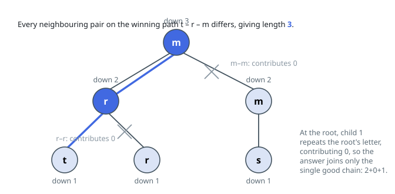

# Solutions — Longest Path With Unequal Adjacent Letters

## Postorder tree DP on the top two chains

Write `down[u]` for the length of the longest legal chain that begins at `u`
and descends only into `u`'s own subtree. Every legal path in the tree has a
unique topmost node — the point where it dips into two different child
subtrees — so the answer is the largest, over all `u`, of `first + second + 1`,
where `first` and `second` are the two biggest usable chains hanging off `u`.
That decomposition is why a single bottom-up sweep computing `down` finds the
optimum without ever tracing a path end to end.

Whether a child's chain is _usable_ at `u` depends on the letters: a child `v`
offers `down[v]` when `s[v]` and `s[u]` differ, and offers nothing when they
match, since the joining edge would sit between two equal letters. Each node
scans its children once, maintaining the two largest offers in `first` and
`second`, then records `down[u] = first + 1` and offers `first + second + 1`
to the global maximum. Both `+1`s are the node itself; seeding the maximum
at `1` also answers the one-node tree.

In the figure's tree, both leaves under node `3` have `down = 1`, but only the
`t` child's offer survives the letter test at `r`, giving `down[3] = 2`; the
root's other child repeats its letter, so at the root the answer is built from
one good chain alone: `2 + 0 + 1 = 3`.

With `n` up to `10⁵`, deep recursion is a stack-overflow risk, so the
implementation builds children lists from `parent`, emits a preorder with an
explicit stack — parents always precede children — and walks that list
backwards as its postorder evaluation order. Nodes and edges are each touched
a constant number of times.

**Complexity:** `O(n)` time, `O(n)` space.
