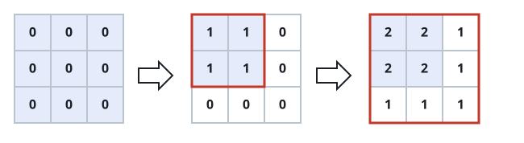

# Stacked Corner Rectangles II

## Description

Start with an `m x n` grid `G` of all `0`'s. You are also given a list of
stamps `ops`, where `ops[i] = [ai, bi]` means every cell `G[x][y]` with
`0 <= x < ai` and `0 <= y < bi` gets incremented by one — a rectangle
stamp anchored at the grid's top-left corner.

After every stamp has been applied, return how many cells hold the
largest value that appears anywhere in `G`.

### Example 1



```text
Input: m = 3, n = 3, ops = [[2,2],[3,3]]
Output: 4
Explanation: Every cell reaches a value of at most 2, and exactly four
cells (the top-left 2x2 block) reach that maximum, so the answer is 4.
```

### Example 2

```text
Input: m = 5, n = 4, ops = [[3,4],[5,2],[2,3],[4,4]]
Output: 4
Explanation: The four stamps overlap most narrowly in the region shared by
all of them, which spans 2 rows and 2 columns — a maximum reached by
exactly 4 cells.
```

### Example 3

```text
Input: m = 6, n = 2, ops = []
Output: 12
```

### Constraints

- `1 <= m, n <= 4 * 10⁴`
- `0 <= ops.length <= 10⁴`
- `ops[i].length == 2`
- `1 <= ai <= m`
- `1 <= bi <= n`
