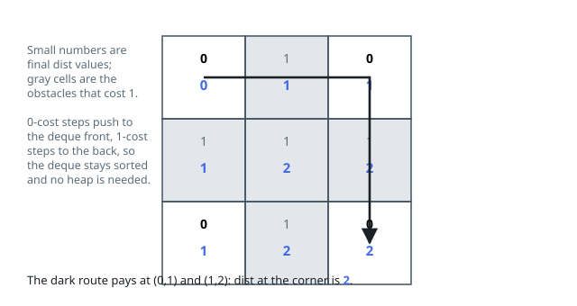

# Solutions — Cheapest Corner-to-Corner Route

## 0-1 BFS with a deque

Build a graph on the cells: every orthogonal pair of cells is joined,
and stepping onto a neighbour weighs `grid[neighbour]` — one when an
obstacle must be cleared there, zero for an open cell. Under these
weights the cheapest path from `(0, 0)` to `(m-1, n-1)` is exactly the
fewest obstacles a route clears. And because no weight exceeds one,
Dijkstra folds into 0-1 BFS: a relaxation of weight 0 pushes to the
*front* of a deque and a relaxation of weight 1 to the *back*. The
deque's distances therefore never decrease, so each cell popping off
the front is final — the priority queue is never missed.

The scan keeps a `dist` grid flooded with infinity except `dist[0][0] =
0`. For every neighbour of a popped cell the candidate is `d +
grid[ni][nj]`; it is recorded, and the cell enqueued, only when it
strictly beats the neighbour's current distance. That strictness prunes
stale work and caps how often a cell can re-enter the queue — its
distance can only drop a bounded number of times (in fact at most
twice: from infinity to 1, then possibly to 0). Nothing is ever
impassable here: every in-bounds neighbour is enterable at a price.

In the cross-shaped example, the two obstacles touching the start are
its only exits and the two touching the far corner are its only
entrances, so one clearing at each end is unavoidable — and a route
paying exactly those two, past (0,1) and then (1,2), brings the corner
to distance 2.

Each cell is expanded a bounded number of times, so the traversal is
linear in the grid. The answer is `dist[m-1][n-1]`; it could only stay
infinite if the corner were unreachable, which the all-enterable grid
rules out.

**Complexity:** `O(mn)` time, `O(mn)` space.
