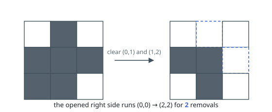
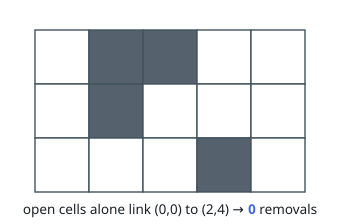

# Cheapest Corner-to-Corner Route

## Description

You are given an `m x n` grid in which every cell holds either `0` or
`1`: `0` is an open cell, `1` is an obstacle. Movement is orthogonal —
from any cell you may step up, down, left, or right.

You travel from the upper-left cell `(0, 0)` to the lower-right cell
`(m - 1, n - 1)`. Entering an open cell is free; entering an obstacle
means clearing it out of the way, and every obstacle you clear counts
once.

Return the least number of obstacles that must be cleared on some
corner-to-corner route.

### Example 1

```text
Input: grid = [[0,1,0],[1,1,1],[0,1,0]]
Output: 2
Explanation: Clearing the obstacles at (0, 1) and (1, 2) opens the
route (0,0) → (0,1) → (0,2) → (1,2) → (2,2).
No route crosses fewer than two obstacles, so the answer is 2. Clearing
(1, 0) and (2, 1) instead works equally well.
```



### Example 2

```text
Input: grid = [[0,1,1,0,0],[0,1,0,0,0],[0,0,0,1,0]]
Output: 0
Explanation: A route made only of open cells exists — for example
(0,0) → (1,0) → (2,0) → (2,1) → (2,2) → (1,2) → (1,3) → (1,4) → (2,4)
— so nothing needs clearing.
```



### Constraints

- `m == grid.length`
- `n == grid[i].length`
- `1 <= m, n <= 10^5`
- `2 <= m * n <= 10^5`
- `grid[i][j]` is either `0` or `1`.
- `grid[0][0] == grid[m - 1][n - 1] == 0`

## Hints

### Hint 1

Treat the grid as a graph: cells are vertices, orthogonal neighbours are
joined by edges. What should the weight of an edge be, so that a path's
total weight is the obstacles it clears?

### Hint 2

All weights turn out to be 0 or 1. Find the cheapest corner-to-corner
path with a deque-based breadth-first search that never touches a
priority queue.
