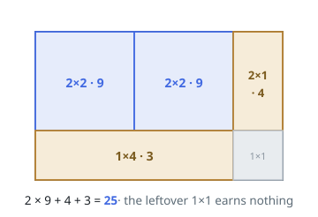
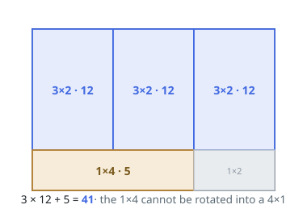

# Wood Cutting Revenue

## Description

A rectangular sheet of wood `m` cells tall and `n` cells wide sits in
front of you, together with a 2D integer array `prices` in which
`prices[i] = [hi, wi, pricei]` means a sheet of height `hi` and width
`wi` sells for `pricei`.

A cut runs straight across the whole sheet — full height or full width —
splitting it into two smaller sheets. Cut as often as you like; whatever
pieces you end up with, sell any of them you choose at their listed
prices. The same shape may be sold several times, and shapes you never
cut toward may go unsold. The grain runs one way: height and width may
not be swapped to match a price.

Return the largest total you can earn from the original `m x n` sheet.

### Example 1

```text
Input: m = 3, n = 5, prices = [[2,2,9],[2,1,4],[1,4,3]]
Output: 25
Explanation: Cut the sheet into two 2 x 2 pieces (2 * 9 = 18), one
2 x 1 piece (4) and one 1 x 4 piece (3), leaving a 1 x 1 corner
unclaimed. Together that is 18 + 4 + 3 = 25, and nothing does better.
```



### Example 2

```text
Input: m = 4, n = 6, prices = [[3,2,12],[1,4,5],[4,1,6]]
Output: 41
Explanation: Cut the sheet into three 3 x 2 pieces (3 * 12 = 36) and one
1 x 4 piece (5); a 1 x 2 strip is left over. Total 36 + 5 = 41.
Turning a 1 x 4 piece sideways is not allowed — it does not become the
4 x 1 shape priced at 6.
```



### Constraints

- `1 <= m, n <= 200`
- `1 <= prices.length <= 2 * 10^4`
- `prices[i].length == 3`
- `1 <= hi <= m`
- `1 <= wi <= n`
- `1 <= pricei <= 10^6`
- All the shapes `(hi, wi)` are pairwise distinct.

## Hints

### Hint 1

Take any sheet of size h x w and list its options: sell it whole at its
listed price, cut it into h x w1 beside h x w2 (w1 + w2 = w), or cut it
into h1 x w above h2 x w (h1 + h2 = h).

### Hint 2

Every option produces strictly smaller sheets, so the pieces form
subproblems ordered by size.

### Hint 3

Let `dp[h][w]` be the best revenue from an h x w sheet — the maximum of
its whole-sale price and every first cut's two halves added together.
The answer sits at `dp[m][n]`.
