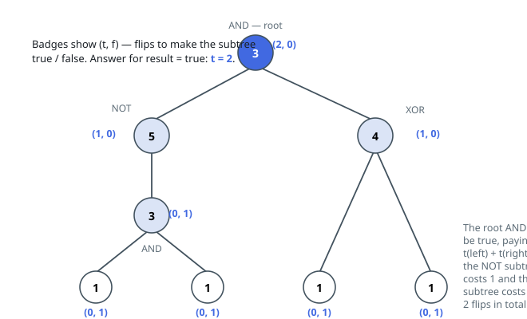

# Solutions — Leaf Flips to Reach a Root Value

## Bottom-up tree DP on (min-true, min-false)

Give every node two numbers: `t(node)`, the fewest leaf flips that make
the subtree rooted there evaluate to true, and `f(node)`, the fewest
that make it false. Flips touch leaves only and the operations at inner
nodes are fixed, so this pair says everything a parent can want from a
child — how the child's value is produced never matters, only what
either value costs. The pair is therefore a DP state that composes.

The leaf base is immediate: a leaf valued `1` costs `(0, 1)`, a leaf
valued `0` costs `(1, 0)`. From there each operator has its own
calculus. OR is true when either child is true — `min(lt, rt)` — and
false only when both are — `lf + rf`. AND is the mirror: `lt + rt` to be
true, `min(lf, rf)` to be false. XOR wants disagreement: true costs
`min(lt + rf, lf + rt)`, false — agreement — costs `min(lt + rt,
lf + rf)`. NOT swaps its only child's pair.

In the worked tree, `AND(NOT(AND(true, true)), XOR(true, true))`, the
two inner operators both sit at `(0, 1)`; the NOT turns that into
`(1, 0)` and the XOR reaches `(1, 0)` on its own, so the root AND pays
`1 + 1 = 2` for a true — flipping one leaf under the NOT and one leaf of
the XOR.

The canonical implementation stays iterative because a tree may hold
`10^5` nodes: BFS from the root records level order, and `t`/`f` arrays
fill by scanning that order backwards, children always ahead of their
parents, with a dictionary mapping nodes to indices for constant-time
lookups. `t[root]` answers a `result` of true, `f[root]` otherwise; a
one-leaf tree falls to the base case, and a `None` root is guarded
upfront. Neither number is ever infinite, since any leaf can be flipped.

**Complexity:** `O(N)` time and `O(N)` space for an `N`-node tree.
