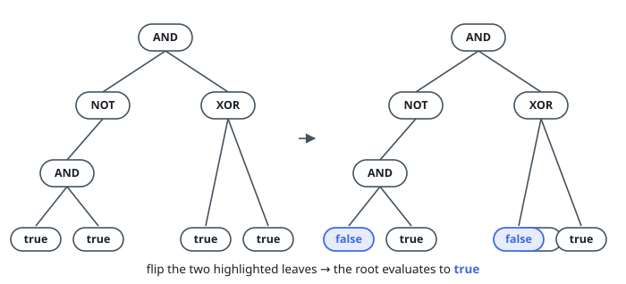

# Leaf Flips to Reach a Root Value

## Description

You are given the root of a binary tree built as a boolean expression:

- A leaf holds `0` or `1`, standing for `false` and `true`.
- Every other node holds `2`, `3`, `4`, or `5`, standing for the
  operations `OR`, `AND`, `XOR`, and `NOT`.

You are also given a boolean `result` — the value the root should
evaluate to.

Evaluation works recursively: a leaf evaluates to its own value, and any
other node evaluates by applying its operation to the evaluations of its
children.

One operation is available to you: flip a leaf, turning `false` into
`true` or `true` into `false`.

Return the fewest flips after which the root evaluates to `result`. Some
number of flips always suffices.

A leaf is a node with no children.

`NOT` nodes carry a single child, on one side or the other; every other
interior node carries two children.

### Example 1

```text
Input: root = [3,5,4,3,null,1,1,1,1], result = true
Output: 2
Explanation: The tree is AND(NOT(AND(true, true)), XOR(true, true)).
Flip one leaf under the NOT — the inner AND then evaluates to false, and
the NOT to true — and one leaf of the XOR, which then evaluates to true.
The root AND sees true AND true. Two flips are necessary and enough.
```



### Example 2

```text
Input: root = [4,0,0], result = true
Output: 1
Explanation: XOR(false, false) is false. One flip makes the leaves
disagree, and XOR of disagreeing leaves is true.
```

### Constraints

- The tree holds between `1` and `10^5` nodes.
- Every node value is between `0` and `5`.
- `OR`, `AND`, and `XOR` nodes carry two children each; a `NOT` node
  carries exactly one.
- Leaves hold `0` or `1`; interior nodes hold `2`, `3`, `4`, or `5`.

## Hints

### Hint 1

A flip only ever changes a leaf, so internal nodes are what they are.
What is the smallest fact about a subtree that its parent needs?

### Hint 2

For every subtree, track two numbers side by side: the least flips that
make it true, and the least flips that make it false.

### Hint 3

At an operation node, combine the children's pairs by trying, for each
outcome, the cheapest way the operation can produce it.
