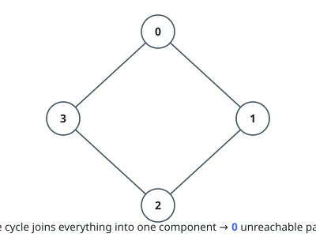
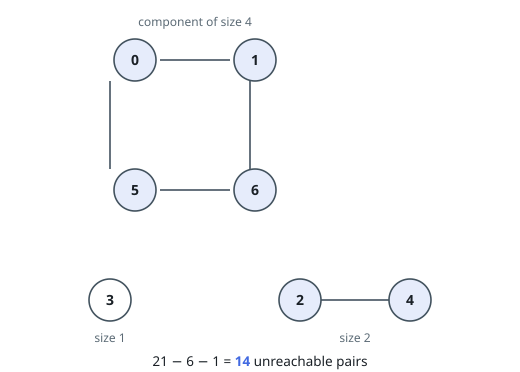

# Unreachable Node Pairs

## Description

An undirected graph has `n` nodes numbered `0` to `n - 1`. A 2D integer
array `edges` lists its connections: `edges[i] = [a_i, b_i]` joins
`a_i` and `b_i` in both directions.

Count the pairs of distinct nodes `(x, y)` between which no path exists.

### Example 1

```text
Input: n = 4, edges = [[0,1],[1,2],[2,3],[3,0]]
Output: 0
Explanation: The four edges close a cycle through all four nodes, so
every node can reach every other node and no pair is cut off.
```



### Example 2

```text
Input: n = 7, edges = [[0,1],[0,5],[1,6],[5,6],[2,4]]
Output: 14
Explanation: The nodes fall into components of sizes 4 (the cycle
0-1-6-5), 2 (the pair 2-4) and 1 (node 3). Of the 21 pairs of distinct
nodes, the 6 inside the cycle and the single pair inside {2,4} can reach
each other; the remaining 21 - 7 = 14 cannot.
```



### Constraints

- `1 <= n <= 10^5`
- `0 <= edges.length <= 2 * 10^5`
- `edges[i].length == 2`
- `0 <= a_i, b_i < n`
- `a_i != b_i`
- No edge appears twice.

## Hints

### Hint 1

Two nodes of an undirected graph are mutually reachable exactly when a
walk joins them — which structure captures that equivalence?

### Hint 2

For a node in a component of size `s`, exactly the `n - s` nodes outside
are unreachable; every member of one component shares the same count.

### Hint 3

Compute `C(n, 2)` minus the sum of `C(s, 2)` over component sizes. The
counts overflow 32 bits well before `n = 10^5`.
