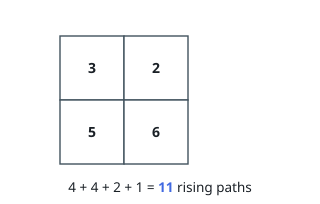

# Rising Paths in a Grid

## Description

You are given an `m x n` integer matrix `grid`. From any cell you may
step to any of the four adjacent cells.

A **rising path** is a sequence of cells, visited one step at a time,
whose values strictly increase from each cell to the next. A path may
start on any cell and stop on any cell, and a single cell by itself
counts as a path of length one.

Report how many rising paths the grid contains, modulo `10^9 + 7`.

Two paths are the same only when they visit exactly the same sequence of
cells.

### Example 1

```text
Input: grid = [[3,2],[5,6]]
Output: 11
Explanation: Grouped by length:
- Length 1: [3], [2], [5], [6].
- Length 2: [3 -> 5], [2 -> 3], [2 -> 6], [5 -> 6].
- Length 3: [2 -> 3 -> 5], [3 -> 5 -> 6].
- Length 4: [2 -> 3 -> 5 -> 6].
That is 4 + 4 + 2 + 1 = 11 paths.
```



### Example 2

```text
Input: grid = [[6],[6]]
Output: 2
Explanation: The cells hold equal values, so no step strictly increases.
The only rising paths are the two single cells.
```

### Constraints

- `m == grid.length`
- `n == grid[i].length`
- `1 <= m, n <= 1000`
- `1 <= m * n <= 10^5`
- `1 <= grid[i][j] <= 10^5`

## Hints

### Hint 1

How many rising paths begin at a given cell — can that number be built
from the same question about neighbouring cells?

### Hint 2

Let `f(i, j)` count the rising paths that start at `(i, j)`. Relate it
to `f` at the four neighbours whose values exceed `grid[i][j]`.

### Hint 3

Values strictly rise along a path, so no path can return to a cell it
left. In what order can you compute `f` so that every needed neighbour
is finished first?
