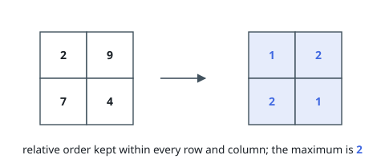

# Smallest Maximum After Renumbering a Grid

## Description

You are given an `m x n` matrix `grid` holding distinct positive integers.

Rewrite every number in the matrix with a positive integer so that both of
these hold:

- order inside rows and columns survives: if two cells share a row or a
  column, the one with the larger original number ends with the larger new
  number;
- the largest number in the finished matrix is as small as possible.

Several different replacements can reach that smallest maximum. This judge
expects one canonical answer: visit the cells from smallest original number
to largest — the values are distinct, so the visiting order is fixed — and
write into each cell the smallest positive integer larger than every number
already sitting in its row and its column.

Return the rewritten matrix.

### Example 1

```text
Input: grid = [[2,9],[7,4]]
Output: [[1,2],[2,1]]
Explanation: The 2 is the smallest number in its row and its column, so it
becomes 1; likewise the 4. The 7 then needs to beat 1 in both directions, so
it becomes 2, and so does the 9. No replacement keeps every order while
peaking below 2.
```



### Example 2

```text
Input: grid = [[42]]
Output: [[1]]
Explanation: A lone cell has nothing to compare against, so it takes the
smallest positive integer there is.
```

### Example 3

```text
Input: grid = [[9,2],[6,4],[1,8]]
Output: [[4,1],[3,2],[1,3]]
Explanation: The smallest number overall, 1 in the bottom-left, takes value
1. The 2 takes 1 as well: nothing smaller sits in its row or column. The 4
must exceed the 2's new 1, the 6 must exceed both the 4's 2 and the 1's 1,
and the 9 ends at 4, dominating its row's 1 and its column's 3.
```

### Constraints

- `m == grid.length`
- `n == grid[i].length`
- `1 <= m, n <= 1000`
- `1 <= m * n <= 10⁵`
- `1 <= grid[i][j] <= 10⁹`
- all numbers in `grid` are distinct

## Hints

### Hint 1

Which cell is always safe to renumber as 1, and which should be renumbered
last?

### Hint 2

A cell's new value only ever has to exceed numbers in its own row and
column — cells elsewhere in the matrix put no pressure on it.

### Hint 3

Number the cells in increasing order of their original values. When a cell's
turn arrives, what has already been written around it?
