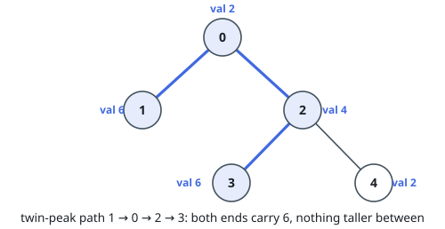
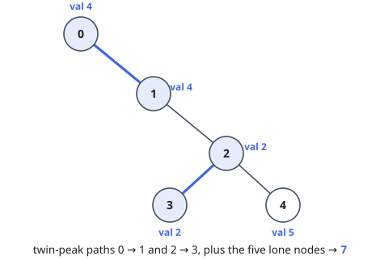
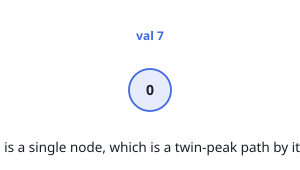

# Twin-Peak Paths in a Tree

## Description

You are given a tree — a connected, acyclic, undirected graph — on `n` nodes
numbered `0` through `n - 1`. Each node `i` carries a value `vals[i]`, and the
array `edges` lists the `n - 1` joins, where `edges[j] = [u_j, v_j]` connects
nodes `u_j` and `v_j`.

Call a simple path along tree edges a **twin-peak path** when

- its two endpoints carry the same value `v`, and
- every node strictly between them carries a value of at most `v` — the two
  endpoints are jointly the highest points on the path.

Return the number of distinct twin-peak paths. A path and its reverse count
once, and a lone node is a twin-peak path by itself.

### Example 1

```text
Input: vals = [2,6,4,6,2], edges = [[0,1],[0,2],[2,3],[2,4]]
Output: 6
Explanation: Five twin-peak paths consist of a single node.
The sixth is 1 -> 0 -> 2 -> 3, whose endpoints both carry 6.
(Its reverse 3 -> 2 -> 0 -> 1 is the same path.)
Note that 0 -> 2 -> 4 has equal endpoints carrying 2, but node 2 between
them carries 4 — taller than the endpoints — so it is not a twin-peak path.
```



### Example 2

```text
Input: vals = [4,4,2,2,5], edges = [[0,1],[1,2],[2,3],[2,4]]
Output: 7
Explanation: Five single-node paths, plus 0 -> 1 (both endpoints carry 4)
and 2 -> 3 (both carry 2).
```



### Example 3

```text
Input: vals = [7], edges = []
Output: 1
Explanation: One node, one path.
```



### Constraints

- `n == vals.length`
- `1 <= n <= 3 * 10⁴`
- `0 <= vals[i] <= 10⁵`
- `edges.length == n - 1`
- `edges[j].length == 2`
- `0 <= u_j, v_j < n`
- `u_j != v_j`
- `edges` describes a valid tree.

## Hints

### Hint 1

Group the nodes by value. What can you say about all twin-peak paths whose
endpoints carry the group's value `v`, if every node with a smaller value
has already been dealt with?

### Hint 2

Grow the tree value layer by value layer: add the nodes of smallest value
first, and connect each new node to the neighbours already present.

### Hint 3

When a layer is complete, which classic structure tells you in near-constant
time whether two of its nodes are connected through the layers added so far?
