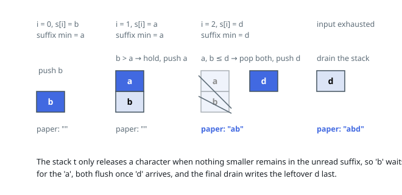

# Solutions — Smallest Output Through a Stack

## Greedy with suffix minima and a stack

The intermediate stack receives letters in `s`'s order (each move-from-s is a
push) and releases them only from its top (each pop appends to the sheet), so
the sheet ends up holding some pop sequence of the stack. The task is to
choose the push/pop interleaving whose pop sequence is lexicographically
smallest.

The greedy rule follows: a letter on top of the stack should be written now
whenever it is less than or equal to every letter still unread in `s`.
Writing it can never be wrong, since every later arrival is at least as
large and therefore belongs after the current top in the optimal sheet.
Conversely, while some smaller letter is still unread, the top must wait and
pushing continues until that letter has been exposed. Applying the test in
constant time per step needs `suffix_min[i]`, the smallest letter in
`s[i..]`, with a sentinel larger than any letter at position `n`.

The sweep walks `s` left to right. Before pushing `s[i]` it pops the stack
while the top satisfies `top <= suffix_min[i]` — everything popped is safe to
emit, because nothing smaller remains unread — and then pushes `s[i]`. When
the input runs out, `suffix_min[n]` is the sentinel, so the final drain
flushes the stack (deepest letters last) through the very same condition.

Each letter is pushed once and popped once, and the suffix-minimum table is
one right-to-left pass, so the whole run is linear. The equality in
`top <= suffix_min[i]` matters: popping ties early is safe and never holds a
letter without cause. The sentinel exceeds every lowercase letter, which
turns the drain into just another instance of the main loop's test.

**Complexity:** `O(n)` time, `O(n)` space.
