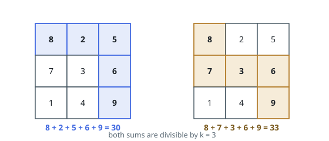
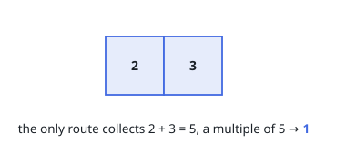
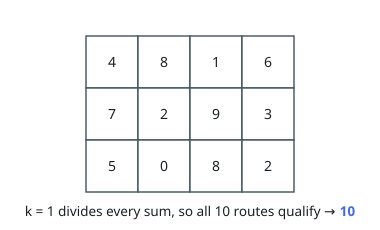

# Count Grid Paths With Divisible Sum

## Description

You are given an `m x n` integer matrix `grid` and an integer `k`.

A route begins in the top-left cell, ends in the bottom-right cell, and steps
only right or down. Every cell a route visits adds its value to the route's
sum, start and finish included.

Return the number of routes whose sum is divisible by `k`. The count can be
large, so report it modulo `10^9 + 7`.

### Example 1

```text
Input: grid = [[8,2,5],[7,3,6],[1,4,9]], k = 3
Output: 2
Explanation: Two routes collect a multiple of 3.
The first runs right, right, down, down: 8 + 2 + 5 + 6 + 9 = 30.
The second runs down, right, right, down: 8 + 7 + 3 + 6 + 9 = 33.
```



### Example 2

```text
Input: grid = [[2,3]], k = 5
Output: 1
Explanation: The single route collects 2 + 3 = 5, a multiple of 5.
```



### Example 3

```text
Input: grid = [[4,8,1,6],[7,2,9,3],[5,0,8,2]], k = 1
Output: 10
Explanation: Every integer is a multiple of 1, so all 10 routes qualify.
```



### Constraints

- `m == grid.length`
- `n == grid[i].length`
- `1 <= m, n <= 5 * 10⁴`
- `1 <= m * n <= 5 * 10⁴`
- `0 <= grid[i][j] <= 100`
- `1 <= k <= 50`

## Hints

### Hint 1

For this question a route is fully described by one small fact about its
sum — and that fact survives replacing every cell value by its remainder
modulo `k`.

### Hint 2

Give each cell a row of `k` counters: how many arriving routes carry each
residue. Routes reach a cell only from above or from the left.

### Hint 3

Combining two incoming counter rows takes a cyclic shift by the cell's own
remainder; and since only the previous row is ever read, one rolling row of
vectors is enough storage.
